# May 2025 (20250518)

---

*Release date: May 18, 2025*

---

Welcome to the May 2025 release of the ZeuZ platform. There are many updates in
this version that we hope you'll like, some of the key highlights include:

**Features**

- Seamless ZeuZ Node connect
- AI-Powered Mobile inspector
- Variable viewer in Debug page
- AI-Powered Release report summary
- Pre-requisite test case
- Rerun an existing RunID
- Fail analysis report

<!-- truncate -->

**Bug fixes**

- Testing > Reports > Release Report > Fix report generation issue when GitHub
  integration is missing.
- Testing > Testcase > Create Testcase > Step > Fixed step section slider
  visibility issue Caused by Table Insertions in Description or Expected Fields
- Global attachments scope fix.
- Testing > Reports > Execution > Build to Build comparison bug fixed.

**Other enhancements**

- Testing > Reports > Fail Analysis > Improve assignee user search functionality.
- Testing > History > Optimized page load time/performance.
- Project > Create/Edit > Task, Bug & Requirement pages > Feature shows up in wrong
  team/project.
- Testing > Deployments > History & Set page > Minor UI enhancements.
- Restricted Datastore access by team/project.
- Improved GitHub issue linking process
- Testing > Deployments > History > Run Queue feature and UI updated, also
  fixed/updated some minor problems.
- Storybook Integration for UI Components
- Testing > Deployments > Set/History > Enhanced Donut Charts Feature and Total Value Fix

- Automatic Default Filter for Fail Analysis Report
- Testing > Reports > Fail Analysis > Border Color Redesign for Clarity
- Testing > Test case edit pages, Run History Border Color Now Reflects Test Case Status

## Seamless ZeuZ Node connect

Connect your ZeuZ Node without worrying about launching a terminal and copy
pasting the node command.

[View the accompanying ZeuZ Node release](https://github.com/AutomationSolutionz/Zeuz_Python_Node/releases/tag/v20.0.0).

<video controls loop>
  <source src="/blog/zeuz-platform-20250518/Connect ZeuZ Node.mp4" type="video/mp4" />
</video>

## AI-Powered Mobile inspector

Inspect Android (tm) applications right inside ZeuZ Server without having to
install additional tools such as Appium Inspector or Android uiautomatorviewer.

Installing these tools and configuring them was a real challenge and often times
a nightmare involving hours of fiddling around with setups. Now, all you need to
do is connect your mobile device or launch an emulator in your computer, run
ZeuZ Node and connect it to the ZeuZ server. ZeuZ server will take care of the
rest. This also brought one additional benefit that was otherwise impossible to solve previously:

> You do not have to restart the adb server every time after you've inspected
> them through Appium/uiautomatorviewer.

**Features**

1. **Screenshot and Element Tree Detection**: Improved accuracy in detecting and displaying UI elements.  
2. **Attribute List Panel**: A dedicated right-side panel for inspecting element attributes.  
3. **Search Functionality**: Use **Ctrl+F** to search by CSS, XPath, or value.  
4. **Dual DOM Support**: ADB and Appium now both provide DOM access, eliminating inspection barriers when the Appium server is active.  

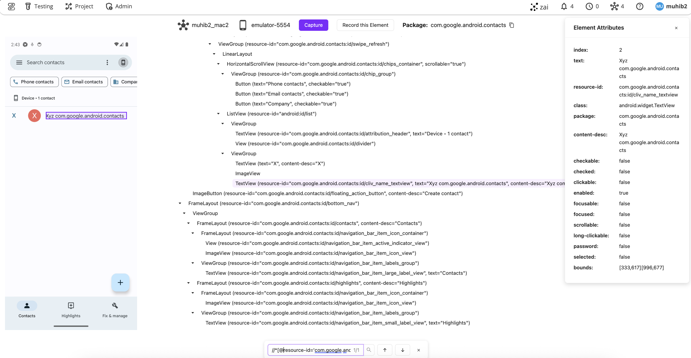

## Variable viewer in Debug page

When debugging a test case, users often need to inspect current Zeuz node variables to build further actions. This feature introduces a hierarchical tree view of variables in the Debug page, providing a clean and intuitive interface to navigate complex data structures. Variables are displayed in three distinct formats:  

1. **JSON Object Variables**: Standard JSON-compatible variables with reasonably sized values.  
2. **JSON Schema Variables**: Large JSON variables that are truncated for readability and presented as schemas.  
3. **Non-JSON Variables**: Non-JSON objects (e.g., Python modules, WebDriver instances, WebDriver elements) with up to 200 properties displayed.  
4. **Oversized Values**: Variables with excessively large values—even after schema conversion—are omitted for performance.  

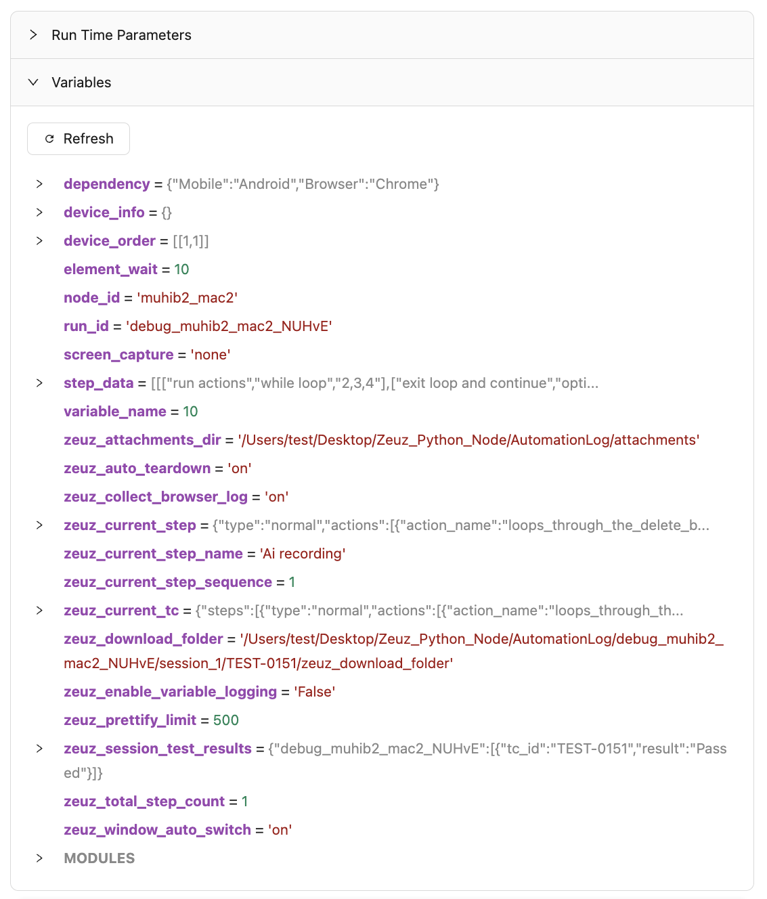

## AI-Powered Release report summary

An intelligent report summary component has been added to analyze release data and present key insights through a modern UI. This feature enables stakeholders to quickly assess release impact, quality, and notable changes without sifting through lengthy detailed reports.

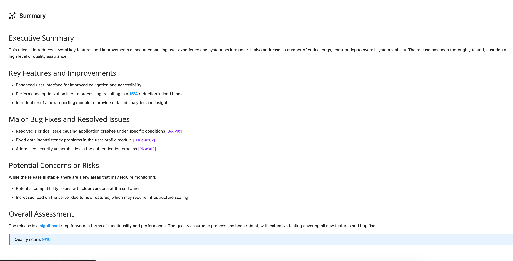  

## Pre-requisite test case

The pre-requisite test case feature will allow one test case to mark another
test case as it's pre-requisite. When the test case is deployed, the
pre-requisite test case will get executed first before itself.

When multiple test cases have a common pre-requisite test case and they are
deployed, the pre-requisite test case will be executed only once throughout that
entire RunID (run session).

Pre-requisite chain must not form a cyclic dependency. They will be prevented
during link time and deployment time.

**Background / Context**

- In many test environments, testers typically need to perform pre-test setup
such as data preparation, environment setup with docker or other tools, etc. To
achieve this with ZeuZ, users had to rely on set re-ordering feature to ensure
that the pre-setup tests are executed at the beginning.

- There are also cases where a single test set may contain multiple groups of
test cases which have their own pre-requisites.

- A test case which has a pre-requisite can be present in multiple sets.

All of the above makes it challenging for a tester to debug or run test cases
that contain pre-requisite steps.

**Pre-requisite search in test case details tab:**  
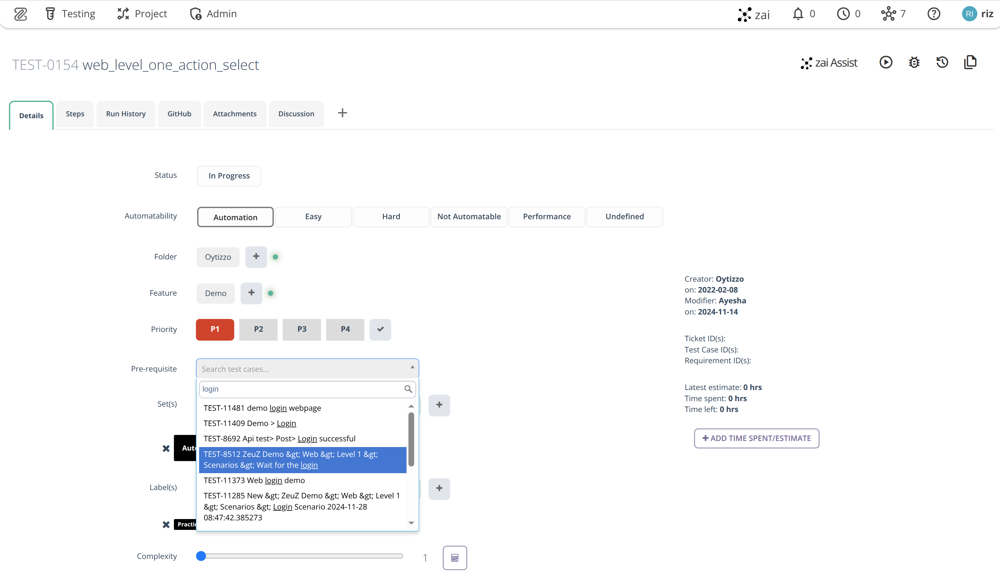

---

**Pre-requisite, once selected:**  
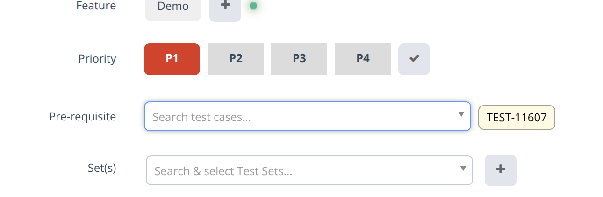

---

**Rerun and pre-requisite selection from Testing > Run tests page:**  
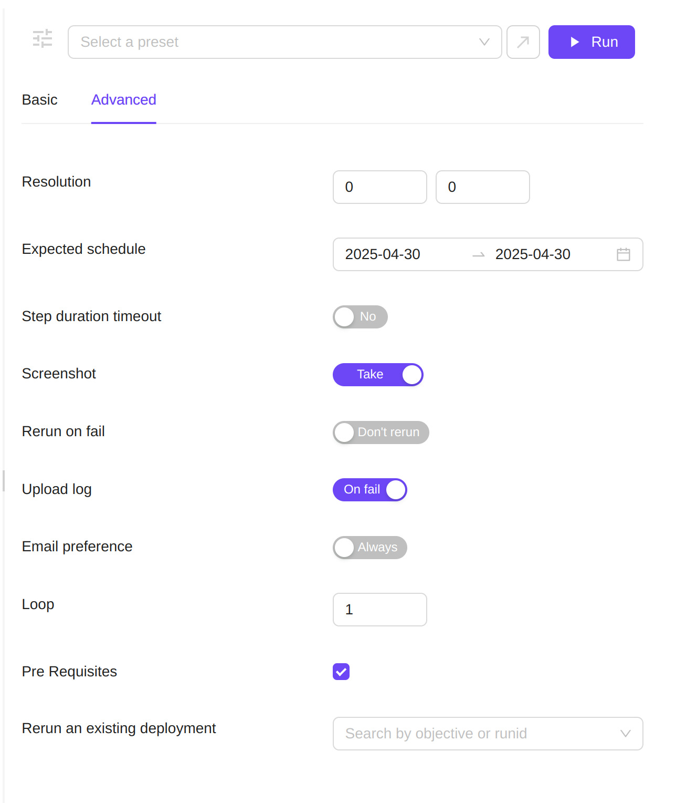

## Rerun an existing RunID

Lets users re-run an existing runid or a selected number of test cases in a
runid.

**Background**

During day to day operations, users often find themselves trying to rerun test
cases in an already completed/in-progress runid for various reasons, including
but not limited to:

1. A test case failed due to a temporary issue. It's not possible or
   economically feasible to rerun a whole test set of 1k+ test cases again just
   to make the RunID status green.
2. Node was killed before it could send reports to the server because a test
   case was processing data that could not fit into the RAM. Thus, leaving the
   test case as submitted in the RunID.

**Search runids for rerun (Testing > Run tests > Advanced settings)**  
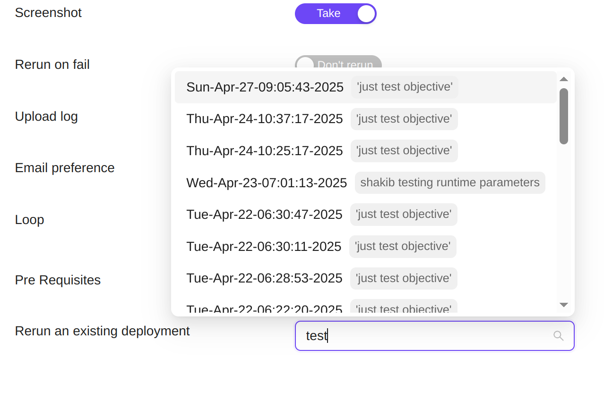

## Fail analysis report

When one or more test cases fail across multiple test cases, it becomes very
hard for testers and managers alike, to find the root or common cause of
failures. Its also hard to *not create* duplicate bug reports for the same
failure reason because multiple people may be working through the failed test
cases at the same time. This creates a lot of confusion and frustration among
the QAs, Devs and Managers while being a source of time waster.

ZeuZ Fail analysis report solves this issue by analyzing all your failed test
steps for common cause of failures and group them together. Ideally, if one test
case is fixed, all other test cases in the same group should be fixed
automatically as long as the steps are global.

### How It Works

- Testers or managers can access the report by going to the **Report** section
in the Navbar Testing > Reports > Fail Analysis.

On the Fail Analysis section you need to create a filter for your report. 

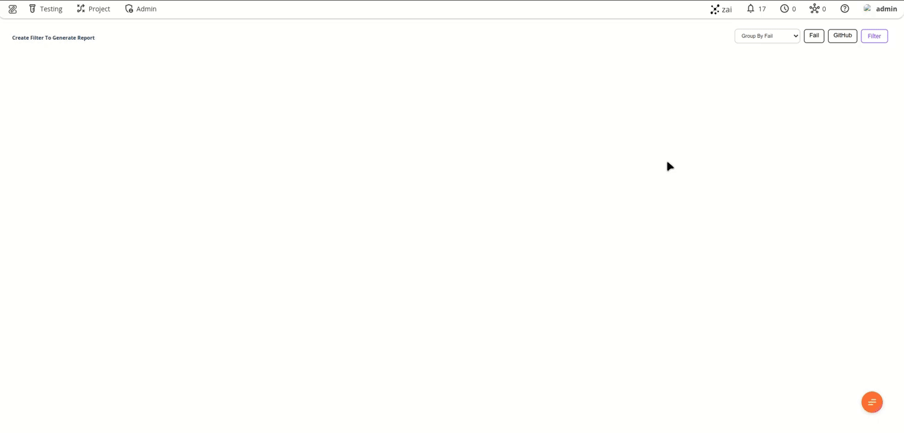

- Here when you click on Filter you will find Milestone, Verson, or Github to
  filter this report
- In this example, we use Milestone 2.9 with compare 2.8.
- After that, it will show you Fail test case report 

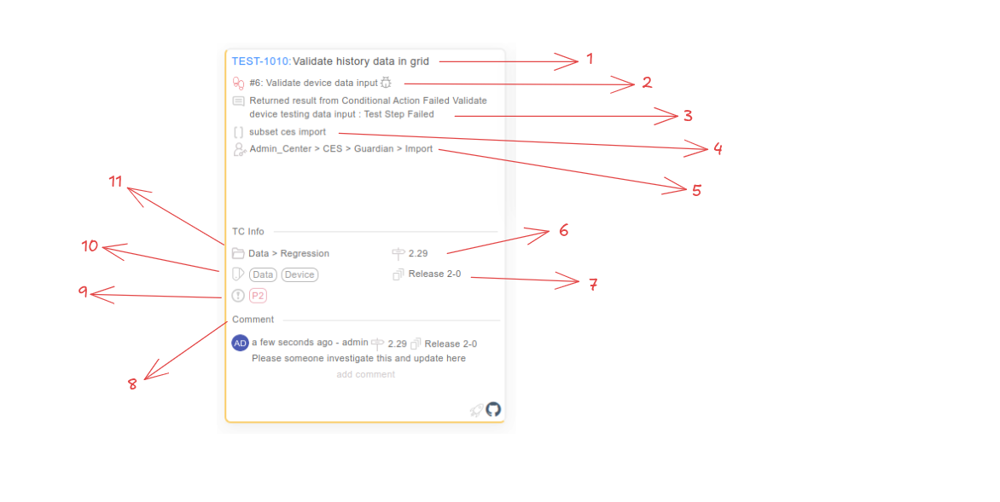

**Description of the card view:**

1. Testcase Title
2. Fail test case step
3. Fail reason
4. Assignee set
5. Assignee feature
6. Assignee milestone
7. Assingee version
8. Comment option anyone can comment and replay here. 
9. Assignee priority
10. Assignee Label
11. Assingee Folder

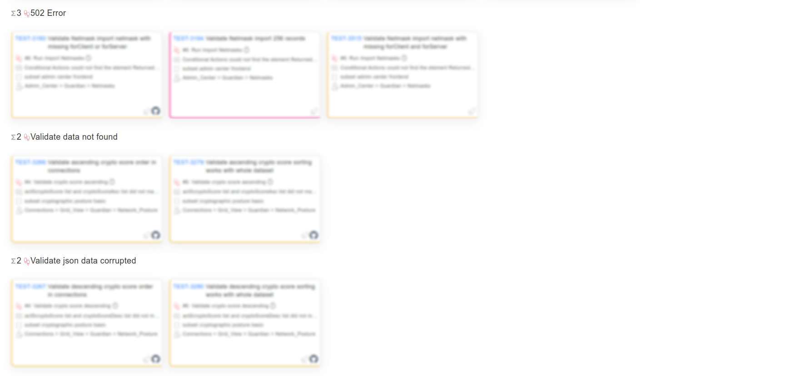
You can also get reports separated by fail test cases by fail type.  

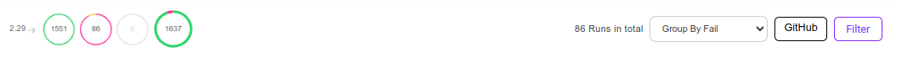

- On top, you can also see fail and pass statuses on top 
- Also you can group by report 
    1. Group by Fail test case
    2. Group by Set
    3. Group by Assignee
- Also there is two tabs Fail is the current tab and Github. If you click on
  GitHub you will find link test case with GitHub issue filter.  

