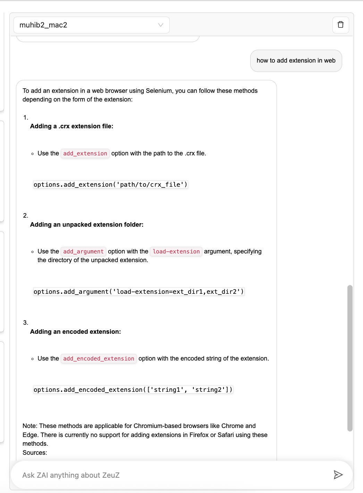

*Release date: July 12, 2025*

Welcome to the July 2025 release of the ZeuZ platform! 🚀 This release brings significant improvements to mobile testing, debugging capabilities, and reporting features that will streamline your testing workflow.

## Introducing Chrome for Testing in ZeuZ!
Experience the power of browser version control like **never before!**

With ZeuZ's new "Chrome for Testing" feature, you can now test your web applications **across any specific version** of Chrome, even on a pre-release build like Dev, Beta, or Canary!

✅ **Seamlessly validate cross-version compatibility**  
✅ **Pinpoint bugs in specific Chrome builds**  
✅ **Future-proof your app by testing against upcoming Chrome features**  
✅ **Save time with fully automated version-targeted testing**  

All you need to do is specify the Chrome version, and **boom** — ZeuZ handles the rest!

Whether you're debugging legacy issues or ensuring readiness for the next big update, this powerful feature puts full browser control in your hands.

**Test smarter. Release faster. Stay ahead.**  
Welcome to the future of browser testing — only on **ZeuZ**.  

### Usage Instructions
To run your test case on a specific version of Chrome, you can specify the desired version directly in the "Go to link" action by adding an additional row with the following format:
| Field | Sub Field | Value |
|--|--|--|
| chrome:version | optional parameter | **%\|my_version\|%** or **125.0.6382.0** |

-   You may use either a **runtime parameter** (e.g., `%|my_version|%`) or a **specific Chrome version string** (e.g., `125.0.6382.0`).
    
-   The system will **first check if the specified version is already available locally**. If not, it will **automatically download, extract, and install** both the Chrome browser and the corresponding ChromeDriver.
    
-   Your test case will then be executed using the specified Chrome version.
    

#### **Smart Version Management:**

-   **Auto-cleanup:** If a Chrome version is not used for **90 consecutive days**, the system will automatically clean up that version and its driver to optimize storage.
    
-   **Latest Version Auto-update:** For the latest Chrome version, the system checks for updates **every 7 days**. If a newer release is detected, it is downloaded and installed automatically.
    
This flexible version management system ensures consistency in your test environments while maintaining optimal performance and storage efficiency.


<video controls loop>
  <source src="/blog/zeuz-platform-20250712/463816684-44b90f6f-bf8b-45d3-a89c-0216e2aafbb4.mp4" type="video/mp4" />
</video>


## ZAI Chatbot Just Got Smarter!

### Summary
ZAI is your AI-powered assistant that simplifies test automation by converting natural language instructions into executable scripts, answering technical questions, and guiding users through complex processes—effortlessly.

#### What’s New:

1. Smarter Memory
  ZAI now remembers your previous interactions by saving chat history and using it as context to provide more personalized and coherent responses.

2. Knowledge-Powered Answers 
A new Question Answering module allows ZAI to pull real-time answers directly from our product documentation and knowledge base. 




## Introducing ZIP Import Support with Attachment Processing for Test Cases
### Summary
This update introduces comprehensive ZIP import functionality for test cases, allowing users to import test cases along with all related attachments (both at the test case and step level). The import flow has been restructured to ensure correct ID mapping before processing attachments, improving data integrity. Backward compatibility is fully maintained for existing JSON imports, and multiple bug fixes and performance optimizations have been applied. This enhancement ensures a more robust and complete import/export experience for test case data.


### Full ZIP Import Support

- You can now import test cases from a ZIP file, including:
- Structured folder support
- Embedded metadata (index.json)
- Seamless import of both test case and step-level attachments

### Attachment Handling Enhancements

- Test Case Attachments: Automatically mapped from old to new test case IDs and saved in structured directories.
- Step Attachments: Mapped using sequence-based step matching and stored with new step IDs.
- Files are inserted into the database with the correct foreign key references.

### File Structure Support
```
TestCases_backup_export.zip
├── index.json
└── test_cases/
    └── {tc_id}/
        ├── tc.json
        ├── attachments/
        │   ├── file1.pdf
        │   └── file2.csv
        └── steps_attachments/
            └── step_{step_id}/
                ├── step_file1.csv
                └── step_file2.txt
```


---

## Introducing Enhanced Scheduler Management UI

We’ve upgraded the Scheduler experience in ZeuZ to make it more powerful and intuitive. Say goodbye to page reloads and hello to smooth, in-context interactions!

### What's New:

1. **Inline Scheduler Creation & Editing**
   - No more page redirects! Creating or updating a scheduler can now be done directly from the **Schedule List** page via a modal interface.

2. **Step-by-Step Scheduler Creation Modal**
   - Clicking **"Create Scheduler"** opens a new guided modal.
   - Fill out necessary fields in a structured, step-by-step format to create a scheduler more efficiently.

3. **Editable Scheduler Details**
   - Clicking on any scheduler name now opens a detailed info modal.
   - View and update scheduler information without leaving the list page.

4. **Bulk Activate/Deactivate Schedulers**
   - Use the **"Select"** option to choose multiple schedulers at once.
   - Then perform a bulk **activate** or **deactivate** action, saving time on repetitive updates.

5. **Run History Access**
   - The **Run History** column now includes a history button. Clicking this button opens a popup showing the most recent run history for that scheduler.
   - Click **"View Full Run History"** within the popup to explore the complete execution history for deeper insights and traceability.

This update significantly improves usability and performance when managing your schedules — giving you more control with fewer clicks.

<video controls loop>
  <source src="/blog/zeuz-platform-20250712/464002801-d5f18d77-886e-49aa-b9d0-0e03ecf8ed7d.mp4" type="video/mp4" />
</video>


## 🚀 ZeuZ Dashboard Page

The **Dashboard Page** is the central hub in **ZeuZ**, providing a powerful overview of your automation ecosystem. From execution engines to test metrics and storage insights — everything is presented in a clean, actionable format.

<video controls loop>
  <source src="/blog/zeuz-platform-20250712/464026255-32f99fe1-df37-413a-a869-925113da4c55.mov" type="video/mp4" />
</video>

### ZeuZ Node Description

> *"ZeuZ Node is the automation engine working behind the scenes to power your test executions."*
> It executes your tests locally or remotely and handles the automation behind the scenes.

### 💾 Download Button

**Download ZeuZ Node** – Quickly install the ZeuZ Node with a single click.

Once clicked, it also reveals a **"How to Connect"** button that provides detailed video guides for connecting ZeuZ Node on different platforms (Windows, Mac, Linux, etc.).

### 🔗 Navigation Tiles

Links to helpful documentation:

* [**[Node](https://docs.zeuz.ai/docs/zeuz-node)**](#) – Node setup and usage details
* [**[Server](https://docs.zeuz.ai/docs/zeuz-server)**](#) – View server documentations
* [**[Changelog](https://docs.zeuz.ai/blog/tags/changelog)**](#) – View recent updates and improvements
* [**[Docs](https://docs.zeuz.ai/)**](#) – Access full documentation for hands-on guidance

### 📊 Build Health

Monitor the quality and stability of your builds based on test execution results.

### Views

* **Milestone** – Health by project milestones
* **Version** – Health by project versions

### Metrics

* ✅ **Pass**: Number and percentage of tests that passed
* ❌ **Fail**: Number and percentage of tests that failed

Hover over the segments to view exact counts and percentages.

> ℹ️ **Note:**
> If you see `NaN%` for Pass or Fail, it means the system doesn't have enough data — likely due to missing or incomplete test results. Ensure your tests are executed properly and the results are uploaded.

### 🍩 Automatability

This section shows a **Donut Chart** representing different categories of test case automatability created by the user:

| Category           | Color    | Example           |
| ------------------ | -------- | ----------------- |
| Automated          | Green    | **70% - 8,464** |
| Easily Automatable | Cyan     | **15% - 856** |
| Hard to Automate   | Orange   | **5% - 312** |
| Not Automatable    | Hot Pink | **2% - 98** |
| Performance        | Purple   | **1% - 46** |
| Undefined          | Gray     | **7% - 401** |

Hovering over each slice reveals the exact count and percentage.

### 🆚 Build Comparison

Compare test results across the last **five builds** to track progress.

* Displays the number of test cases submitted, passed, and failed
* Supports toggling between **Milestone** and **Version** views

> **Example:**
> Previous Build — 1,616 passed / 61 failed
> Recent Build — 1,806 passed / 26 failed

Quickly evaluate whether quality is improving or regressing.

### 🎯 PBC (Priority Based Comparison)

Analyze test outcomes by test case priority (P1 to P4).

* See results for **Passed, Failed, Blocked, Skipped, and Submitted** test cases
* Hover over the chart to see build details
* Focus on **P1/P2 tests** to prioritize critical issues
* Supports toggling between **Current** and **Previous** build
* Hover over the previous or current build buttons to see that build name
* Supports toggling between **Milestone** and **Version** views

> Example:
> P1 — 286 passed / 7 failed
> P2 — 420 passed / 12 failed

This helps identify high-risk areas in your test suite.

### 📈 Test Case Create Velocity

Track how many test cases are being created over time.

* Displays a **30-day history** of test case creation
* Provides a daily breakdown to show productivity and activity trends

---

### 🟢 Scheduler Health

Ensure scheduled executions are running as expected.

* Shows **last 15 runs** for each scheduler
* **Green** – Scheduler ran successfully
* **Hot Pink** – Scheduler failed to run or missed execution

---

### ❓ Orphaned Test Cases

Identify test cases not linked to any active or valid test sets.

These test cases are not currently used in test executions and may need review or reassignment.

---

### 💽 Storage

Keep an eye on your server’s available space.

* Displays both **used** and **available** storage

> Example:
> Used— 40.59 GB (84%)
> Available— 7.79 GB (16%)
