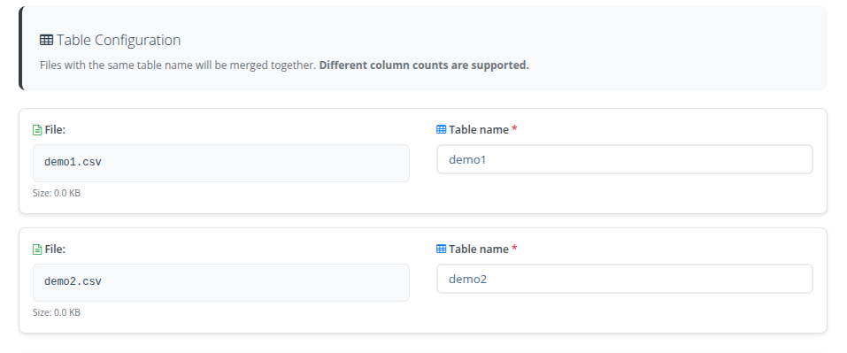

# August 2025 (20250818)

*Release date: August 12, 2025*

---

Welcome to the August 2025 release of the ZeuZ platform! 🚀 This release brings significant improvements to browser testing, AI capabilities, test case management, scheduling, and dashboard features.

## 🚀 Features

- Test case export/import can now handle test case and step attachments
- Scheduler page redesigned
- Release report: GitHub issue type filter added
- Release report: Added date range filtering for GitHub pull requests
- Pre-requisite test case assignment in test case search and test set pages
- ZeuZ Node installation and connection help video in dashboard
- Enhanced ZAI Chatbot with Q&A, history, and improved capabilities
- Minor UI and feature updates/fixes

<!-- truncate -->

## 🐛 Bug Fixes

- Fixed test case import for expected and description fields
- Resolved scheduler-related bugs (multiple fixes)
- Fixed runtest version issue
- Resolved "/" character issue in names
- Fixed watch.mjs file issue
- Implemented datastore team/project separation
- Resolved set import dropdown filter bug
- Fixed set export to JSON bug
- Fixed Slack webhook notification implementation
- Enabled iframe embeds for embedding ZeuZ into dashboads for reporting

---

## 🚀 Dashboard Updates

### Summary
This update focuses on improving clarity, visual representation, and usability in the Dashboard. Key enhancements include cleaner document displays, consolidated build health data, and more informative legends, along with new sections for node and license status.

### ✨ Update Highlights

- **Compressed Document URLs** – Cleaner, shortened display for easier reading
- **Node & License Status Section** – Real-time display of node availability and license usage

- **Build Health & Priority Comparisons** – Selected version/milestone segments now shown at the bottom right of graphs
- **Enhanced Build Health Legends** – Legends now display both count and percentage
- **Merged Build Health Categories** – Fail + Block = Fail, Submit + Skip = Not Run
- **Scheduler Health Legend** – Added legend for better clarity in scheduler health graphs
- **Storage Graph Legend with Counts** – Status counts are displayed in the storage graph legend
- **Dashboard GitHub integration** – Quick stats: total tasks, bugs, requirements created/closed and PR open/closed/merged. PR & issue table. All data are filtered by date-range

<video controls loop>
  <source src="/blog/zeuz-platform-20250818/dashboard-github-integration.mp4" type="video/mp4" />
</video>

## 🧪 Run Test Updates

### Summary
This update improves validation, refines component readability, and enhances layout adaptability for different sidebar sizes. Additionally, the option to notify external services only on failures has been restored in the advanced settings.

### ✨ Update Highlights

- **Improved Version Name Validation** – More accurate checks to ensure valid version naming
- **Advanced Tab Refinements** – Enhanced readability, cleaner layout, and restored "Notify External Services Only on Fail" option
- **Responsive Sidebar Layouts** – Optimized appearance for both large and small sidebar configurations

## ✨ zAI Page Assistance

### Update Highlights
 -   zAI is now enabled server-wide as a contextual assistant for pages and workflows. 
 -   Quick Q&A, page lookup, page-specific guidance. 

<video controls loop>
  <source src="/blog/zeuz-platform-20250818/zai-page-assist.mp4" type="video/mp4" />
</video>

## 📱 Android Support Details

### Summary
Added comprehensive Android support for AI test case generation. Users can now select between web and Android platforms to generate automated test actions, significantly expanding ZAI's capabilities beyond web-only testing.

### ✨ Suported Actions

- **Launch App** – Open Android applications using package name identifiers
- **Enter Text** – Intelligent text input with AI-powered element location
- **Click Element** – Interact with any UI element within Android applications
- **Key Press** – Hardware key interactions including Enter, Volume, Mute, and Back keys
- **Swipe to Element** – Automatic scrolling to reach off-screen elements (partially implemented)

## Close Tab (Selenium + Playwright)

Close tabs reliably by title, by index, or the current active tab. Uses Playwright over CDP when requested, with automatic Selenium fallback for robustness.

### Key Benefits
- **Dual-driver support:** Playwright via CDP or pure Selenium  
- **Accurate tab selection:** Visual left-to-right order for index; filters non-page targets  
- **Dynamic DevTools port:** Uses the live remote debugging port provided by the user.  

### Example 1
| Field       | Sub Field           | Value     |
|-------------|---------------------|-----------|
| playwright  | optional parameter  | True      |
| close tab   | selenium action      | close tab |

### Example 2
| Field       | Sub Field           | Value                  |
|-------------|---------------------|------------------------|
| tab title   | input parameter     | ['Zeuz', 'Google']     |
| playwright  | optional parameter  | True                   |
| close tab   | selenium action      | close tab              |

### Example 3
| Field       | Sub Field           | Value       |
|-------------|---------------------|-------------|
| tab index   | input parameter     | [0, 1, -1]  |
| playwright  | optional parameter  | True        |
| close tab   | selenium action      | close tab   |

If neither **tab title** nor **tab index** is provided, the current active tab is closed.

When `playwright=true`, ZeuZ connects to the Selenium-launched Chrome via the dynamically detected CDP port and executes the close operation.

<video controls loop>
  <source src="/blog/zeuz-platform-20250818/selenium-playwright-dual-driver-first-action.mp4" type="video/mp4" />
</video>

## Accessibility Test

Scans currently rendered webpage in the webdriver for accessibility issues using **axe-core** via Selenium. Generates three reports: raw JSON, summarized JSON, and an HTML report with visual details.

### Key Benefits
- **Comprehensive checks:**  Powered by axe-core; validates against WCAG rules for accessibility.
- **Debug accessibility issues:** Empowers developers to efficiently detect and address accessibility issues, facilitating the creation of more accessible website. 
- **Actionable output:** Summary JSON plus a human-friendly HTML report  
- **CI-friendly:** Clear return values and structured logs for automation 
 

### Usage

| Field             | Sub Field      | Value             |
|-------------------|----------------|-------------------|
| accessibility test | common action  | accessibility test |

### Behavior
- Uses existing Selenium session (`selenium_driver`) from shared variables  
- Waits briefly for page assets to load, injects axe, and runs analysis  
- Saves reports under **Accessibility Test Report/** with sanitized URL and timestamp  
- Logs summary counts: violations, passes, inapplicable, incomplete  

### Reports Generated
- **Raw results (JSON):** `accessibility_result_{url}_{timestamp}.json`  
- **Summary (JSON):** `accessibility_summary_{url}_{timestamp}.json`  
- **Visual report (HTML):** `accessibility_report_{url}_{timestamp}.html`  
- **Location:** `Accessibility Test Report/`  

## Requirements
- An active Selenium driver session must be available in shared variables   

<video controls loop>
  <source src="/blog/zeuz-platform-20250818/web-accessibility-testing.mp4" type="video/mp4" />
</video>

##  Chrome Extension Download

### Summary
Bulk install Chrome extensions during automation runs via an extension-id list. The IDs can be picked from the Chrome Web Store. 

### Use Case & Highlights
-   Provide extension-id list in `Go To Link` action. the platform will download and attach those extensions to the Automation Test browser automatically. 
-   Speed up test setup for projects that rely on extensions (ad-blockers, proxies, custom dev extensions). 

## ⚡ Data Store Updates

### Summary
Enhanced the Data Store functionality to support multiple file uploads simultaneously, with the ability to merge multiple files into a single table. The entire user interface has been modernized by jQuery, providing a more responsive and intuitive user experience.

### ✨ Update Highlights
- **Batch Processing**: Upload multiple files in one operation.
- **File Merging**: Combine multiple data sources into unified tables.
- **Enhanced Preview**: A comprehensive summary is displayed before the final upload.
- **Streamlined Workflow**: The upload process is simplified with fewer steps and improved user guidance.

## Some More Features
- **New Variable `zeuz_tc_logs`** – Dedicated storage for test case errors and logging information
- **Notifications (Discord & Slack)** – Templates simplified for readability. Important failed test cases displayed at the top. Links to testcases are included for quick triage.

- **VM detection** – Automatic fallback to headless mode when a VM is detected and headless wasn’t selected, reduces accidental GUI failures.

## 🐛 Bug Fix Updates

- **Continue Point Value Import** – Resolved issue with continue point values not importing correctly
- **Runtime Parameters Clipboard** – Fixed problem with pasting runtime parameters from clipboard
- **AI Multiple-Action Validation** – Fixed multiple-action return values from AI not being properly checked
- **Take Screenshot Action** – Fixed failure when `Take Screenshot` was the final action in a test step. 
- **Headless Window Size** – Fixed `maximize_window` in headless mode when the window size was unset (prevents headless runs from failing).

## Unified “Links” Tab Implementation Across Pages

### Overview
A major UI/UX restructuring was implemented across multiple pages to streamline navigation and improve usability. Multiple separate tabs for different linked item types have been merged into a single **“Links”** tab. This reduces clutter, improves workflow efficiency, and keeps all related items in one place.

### Changes Implemented

#### 1. **Test Case Edit Page**
- **Merged Tabs:**
  - Requirement
  - Tasks
  - Bugs
  → **Now all accessible from the new “Links” tab**

#### 2. **Requirement Page**
- **Merged Tabs:**
  - Test Case
  - Tasks
  - Bugs  
  → **Now all accessible from the new “Links” tab**

#### 3. **Bug Page**
- **Merged Tabs:**
  - Test Case
  - Tasks
  - Requirements  
  → **Now all accessible from the new “Links” tab**

#### 4. **Task Page**
- **Merged Tabs:**
  - Test Case
  - Requirements
  - Bugs  
  → **Now all accessible from the new “Links” tab**

### Unified “Links” Tab Features
- Single consolidated table for Requirements, Tasks, Bugs, and Test Cases.
- Type icons for easy identification.
- Unified search, filter, and sorting across all linked items.
- Create, link, and manage items directly from one tab.
- Bulk selection and relationship management.
- Fully responsive and mobile-friendly design.

### Benefits
- **Reduced complexity** – fewer tabs to navigate.
- **Improved workflow** – manage all related items from one location.
- **Better organization** – logical grouping of related functionality.
- **Preserved existing features** – all functionality from previous tabs is available in the unified view.

## 🚀 Set, History, and Fail Analysis Page Update

This update improves the visual representation of **pass**, **fail**, **block**, **in progress**, **skip**, and **submit** data in the donut charts and summary donut chart on the **Set**, **History**, and **Fail Analysis** pages. Now, all relevant data is displayed in a single, smooth pop-up chart for better clarity and user experience.

### Update Highlights

- **Relevant Data in One Chart** – View all related information in one consolidated pop-up chart.  
- **Smooth Pop-up** – The pop-up appears instantly when you hover anywhere inside the donut charts.

<video controls loop>
  <source src="/blog/zeuz-platform-20250818/run-history-improved-chart-popup.mp4" type="video/mp4" />
</video>
