Welcome to the September 2025 release of the ZeuZ platform!

## 🚀 New Features
- **Send notifications manually:** Manually send external webhook notifications from the RunID page.
- **Release Report Default Query Creation System:** Guided 5-step wizard to auto-generate queries for ZeuZ, Pull Requests, and GitHub Issues, streamlining workflow setup.
- **Release Report Share:** Complete rewrite with modular structure, improved performance, and modern UI — including Security Monitoring, Enhanced Testing Analytics, and Jira Integration.
- **Cleanup Scheduler:** Automated system to manage storage space and maintain database performance by periodically removing old test run data and log files.
- **Notification System Redesigned:** A new UI notification system with clear stats, color-coded categories, quick navigation, and faster ways to find and act on updates.

## 🐛 Bug Fixes
- **Global Attachment page:** `memory leak`, `delete attachment` & `download attachment` bugs fixed.
- **Web Automation:** Text paste with `(Ctrl+V)` bug fixed.
- **Deploy page:** `Notify External Services Only on Fail` flag bug fixed.
- **Redirect on Login:** After login, redirect to the page you were trying to access.
- **Select Objective:** Deploy page's *Select Objective* infinite loading bug fixed.

## 🛠️ Improvements
- **Slack & Discord notification:** Improved the UI for Discord & Slack notifications. Extra notification sent when some test cases fail.
- **Global Attachment page:** More intuitive file uploads. Easily filter by attachment type. Multiple download & delete. Variable length pagination.
- **Test Case edit page:** Save previous `Explain Testcase` & `Suggest Step Description` response if the test case is not modified again.
- **ProfilePicture Component:** Now supports both username and uid, with smart fallbacks and tooltips for better usability. We added this to make profile handling more flexible and reliable across different workflows while keeping the UI consistent.
- **Release Report Share Performance Optimizations:** Smart merging algorithms, deduplication, caching, background updates, conditional rendering, optimistic UI.

---

## Release Report V2
### **Summary**
We built the new Release Report Share to replace the old version that was hard to maintain, slow to improve, and had a complex UI/UX. The new version is modular, faster, and easier to use, with a modern design and better integrations like GitHub and Jira for smarter, real-time release tracking.

### **5-Step Wizard Process**
1. **ZeuZ Version** → Version selection
2. **Platform Selection** → GitHub (active), GitLab/Jira (coming)
3. **Repository** → GitHub repo selection
4. **Date Range** → PR date filtering
5. **GitHub Config** → Milestones, labels selection

### **Auto-Generated Query Types**
- **ZeuZ Query**: Version-based testing data
- **Pull Request Query**: Date-range filtered PRs
- **Default GitHub Query**: Milestone + label based
- **Issue Query**: Milestone-based issues

### **Release Report Share Summary**
| Component | Purpose | Key Features |
|-----------|---------|--------------|
| **Testing summary** | Test statistics display | Dynamic cards, percentages, automated vs manual |
| **Release overview** | Release information | Title, description, dates, manager profile |
| **Testing section** | Testing overview| Charts, distributions, failed test lists |
| **GitHub section** | GitHub overview| PRs, issues, security, activity tracking |
| **Jira section** | Jira overview| Issue tracking, status analysis |

<video controls loop>
  <source src="/blog/zeuz-platform-20250909/release-report-guided-query.mp4" type="video/mp4" />
</video>

---

## Notification System Redesign

### 📝 Summary
A redesigned notification system with a modern interface, smart filters, interactive features, and improved usability.

### ✨ Update Highlights
#### Smart Notification Bell
- Unread counter with red badge (`99+` for large numbers).
- The bell gives users an instant sense of how many pending items need attention. The `99+` cap avoids overwhelming the user while still signaling urgency.

#### Advanced Filtering & Search
- Search notifications by title, message.
- Category filters: **REQ, TASK, BUG, TC, TEST, Batch**.
- Tabs for **All** and **Unread**, with counters.
- Filters and tabs mirror daily workflows, so users can quickly jump to the right set of notifications. Having **All** and **Unread** in one place ensures nothing slips through while still keeping the focus on new items.

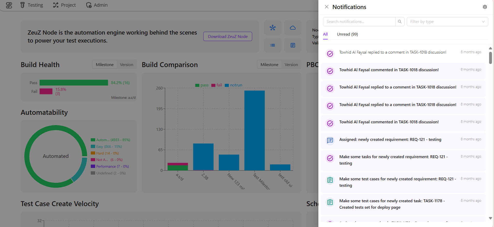

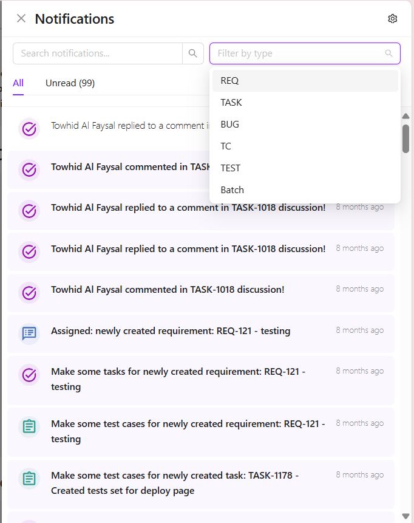

#### Interactive Features
- Click to navigate directly to the related page.
- Auto-mark as read when clicked.
- Highlighting for unread notifications.
- Friendly timestamps (“2 hours ago”, “yesterday”).
- Each interaction reduces friction: clicking a notification takes you straight to context, marking as read happens automatically, and highlights make new items stand out. Relative timestamps provide instant understanding of recency, while animations and empty states make the system feel responsive and clear.

#### Visual Stats and Layout
- Cleaner layout with higher readability.
- Top-level stats (unread counts, categories) provide at-a-glance awareness.
- Color-coded categories improve instant recognition.
- The layout is designed to surface the most important information first. Stats at the top summarize workload immediately, while color-coded categories help users recognize item types without reading in detail. The clean hierarchy makes the panel easy to scan, even on smaller devices.

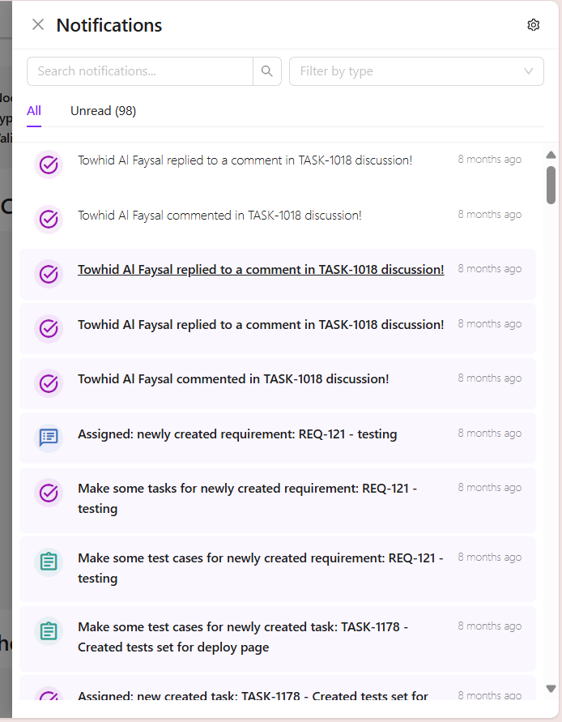

---

## Switch browser window/tab (Includes Playwright capability)

### 📝 Summary

The "Switch browser window/tab" action now supports Playwright. Users can perform this action using Playwright through a remote-debugging port. Previously, this action only supported Selenium. Now, users can perform this action with both Selenium and Playwright according to their preference.

This update is a part of our broader plan to enable both Selenium and Playwright to perform ZeuZ actions. The goal is to let users choose according to their preference instead of enforcing one.

### ✨ Update Highlights

#### Why have both options?

Playwright is comparatively newer and better in some areas than Selenium. What happens when the user wants to migrate from Selenium to Playwright? Do they need to rewrite the test cases that are already using Selenium? Having both Selenium and Playwright makes the migration smooth and easy. With this update, which is a part of our broader plan to enable both options to perform ZeuZ actions, users can easily shift to use Playwright while ensuring they do not necessarily need to change their legacy test cases and setup to make them compatible with Playwright.

#### Easy switch
- Users can easily switch between Selenium and Playwright to perform the mentioned action. If the "playwright" row parameter is true, then the action will use Playwright to switch between tabs; otherwise, Selenium will perform the action.

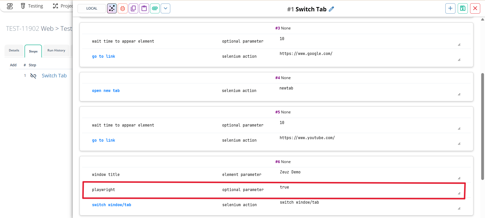

#### Remote debugging port
- To enable Playwright capabilities, users need to provide a remote debugging port. Users only need to provide the remote debugging port for the first webpage only. After that, users can switch to any webpage (i.e., tab) on the webdriver using Playwright. Make sure the port is not blocked. Refer to the screenshot below for providing the remote debugging port. For Selenium, providing a remote debugging port is not required.

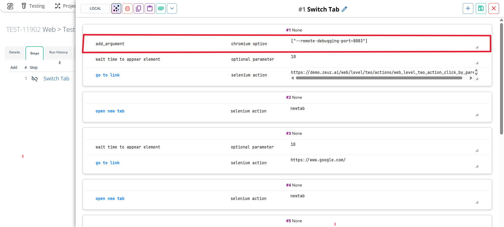

#### Switch tab by title
- Users can switch the tabs by title using Playwright. Selenium still supports switching tabs both by title and index.

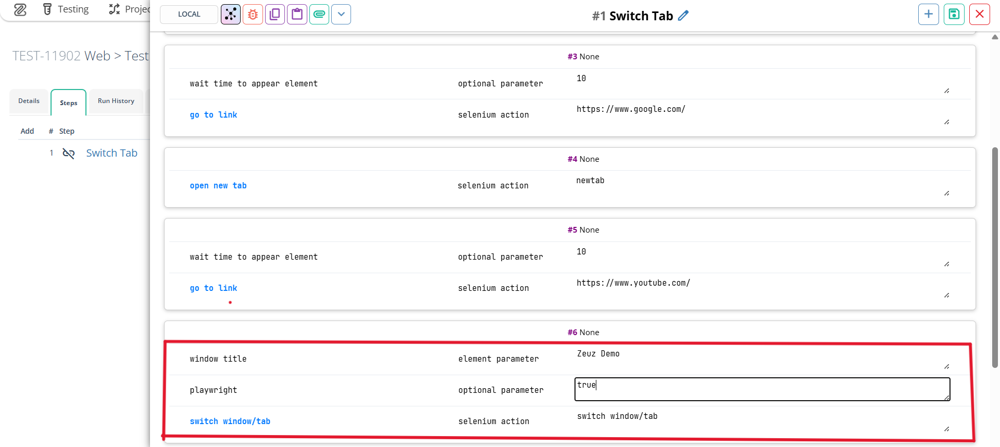

<video controls loop>
  <source src="/blog/zeuz-platform-20250909/switch-tab-demo.mp4" type="video/mp4" />
</video>

## RunId page redesign
### Summary

<video controls loop>
  <source src="/blog/zeuz-platform-20250909/runid-page-redesign.mp4" type="video/mp4" />
</video>

The previous RunId page was originally built with jQuery. While it worked, it had several limitations: users had to perform multiple clicks for simple actions, the design felt outdated, and the overall experience wasn’t optimized for quick decision-making.

As part of our commitment to improving usability and speed, we rebuilt the RunId page in React.js. The redesign is not only more modern and faster, but it also focuses on reducing friction, surfacing the most important information at a glance, and creating a smoother workflow for both testers and reviewers.

### Update Highlights
- Unified RunID and Execute page
- Better and Modern Log view
- Faster loading speed
- Statistics about test cases
- Cleaner design with more information at a glance

### Statistics about test cases

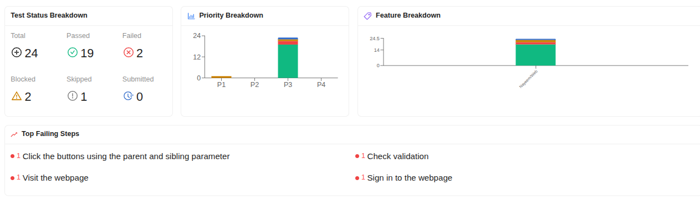

**Why:** Users often need to see the overall health of a run before diving into details.

**Benefit:** Statistics are now displayed at the top, giving immediate insight into test results. This helps teams prioritize where to focus first.

**Testcase Status Breakdown:** See how many test cases were Passed, Failed, Blocked, Skipped, or Submitted at a glance. This gives an instant overview of overall run stability.

**Priority Breakdown:** Results are grouped by Priority 1, 2, 3, and 4 test cases. Each priority level shows how many were Passed, Failed, Blocked, or Skipped.
→ This helps teams identify whether critical (P1/P2) tests are passing, so urgent issues can be addressed first.

**Feature Breakdown:** Test cases are broken down by feature, showing Passed, Failed, Blocked, Skipped, and Submitted counts.
Features are sorted by the total number of Failed + Blocked test cases, and only the top 10 are shown.
→ This highlights the riskiest areas in the product so teams know where to focus fixes.

**Top Failing Steps:** A list of the most common failing steps across all test cases. Clicking a failing step instantly applies filters to show where and why it’s failing.
→ This helps identify recurring issues and speeds up root cause analysis.

### Better and Modern Log view
**Why:** The old logs were hard to grasp and analyze, looked old, and slowed down debugging.
**Benefit:** The new log viewer is more interactive:
- Filter by test step
- Filter by test status (Error, Warning, Passed)
- See more details about test steps by clicking Show Test steps
- We can give more space to logs by dragging between steps and logs

### Cleaner design
**Why:** The previous layout was cluttered and required extra clicks to update information.

**Benefit:**
- The RunId details card now shows all relevant information (version, objective, milestone, comments) in one place, reducing context switching.
- Test case details cards are collapsible, keeping the interface clean while still allowing quick access.
- Hover actions surface Logs, Bugs, and Execution buttons without overwhelming the view.
- Inline step status changes and commenting make updates faster and smoother.

### Unified RunID and Execute page

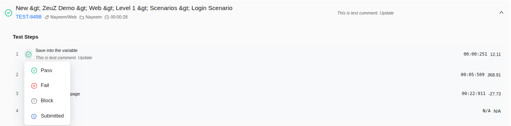

**Why:** Previously, users had to navigate to a separate page to manage manual test cases, which broke workflow and added friction.

**Benefit:** Now everything is unified on one page. You can expand a test case card to see steps, update statuses inline, and add/update comments directly—without leaving the page.

---
## Feature Cleanup Scheduler

### Summary
The Cleanup Scheduler is an automated system that helps manage storage space and maintain database performance by periodically removing old test run data and log files. Users can configure flexible schedules and filtering criteria to control what gets cleaned up and when.

### ✨ Update Highlights

#### Scheduling System
Create cleanup jobs with multiple timing options:
- **Weekly:** specific days and times
- **Monthly:** specific dates and times
- **Calendar-based:** fixed dates
- **Interval-based:** every N minutes or hours

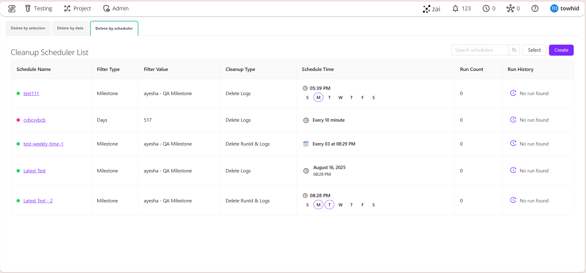

#### Filtering Criteria
Target runs for cleanup based on:
- **Age:** runs older than a defined number of days
- **Milestone:** runs linked to specific test Milestones
- **Version:** runs associated with particular branch Versions
- **Objective:** runs associated with a particular Objective

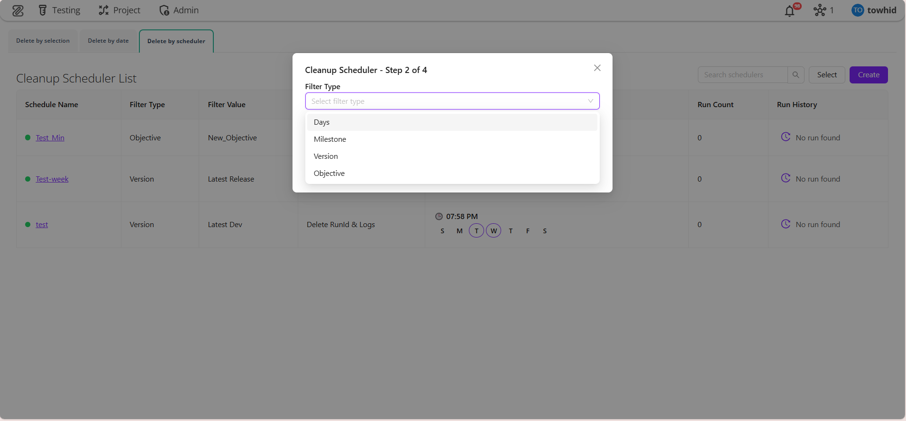

#### Cleanup Types
- **Delete Log:** removes only log folders
- **Delete Run and Log:** removes both database records and log files

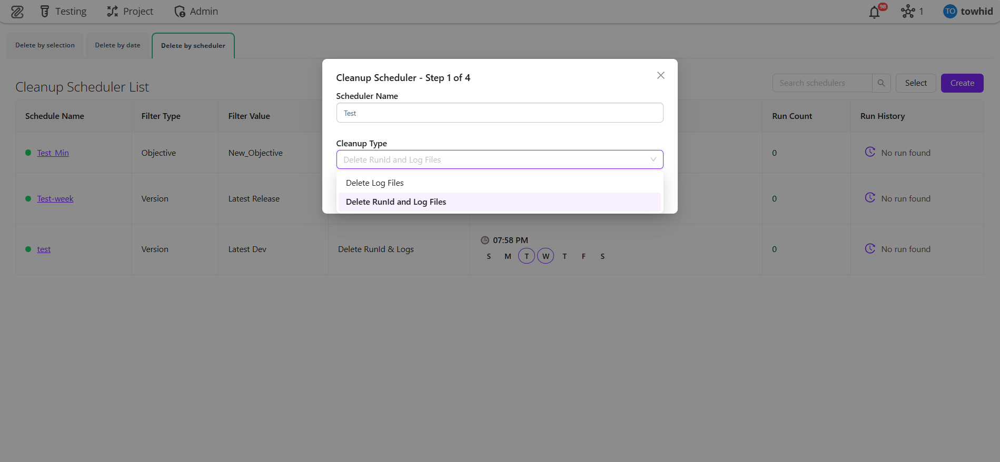
