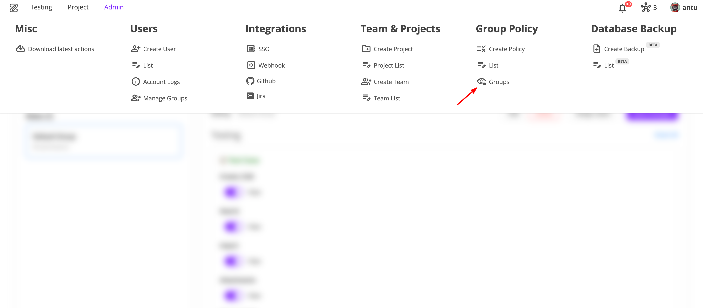
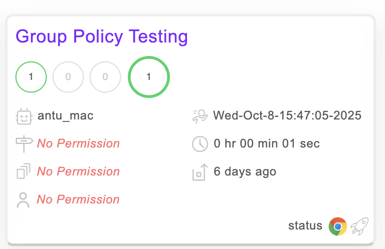
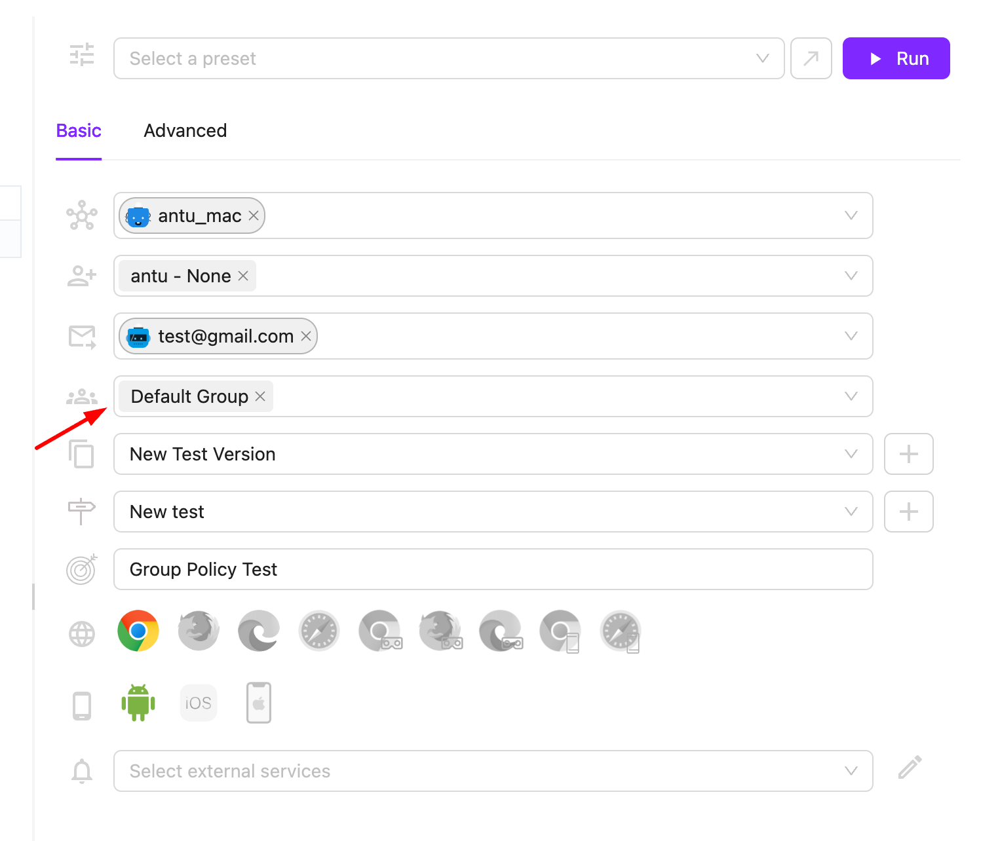
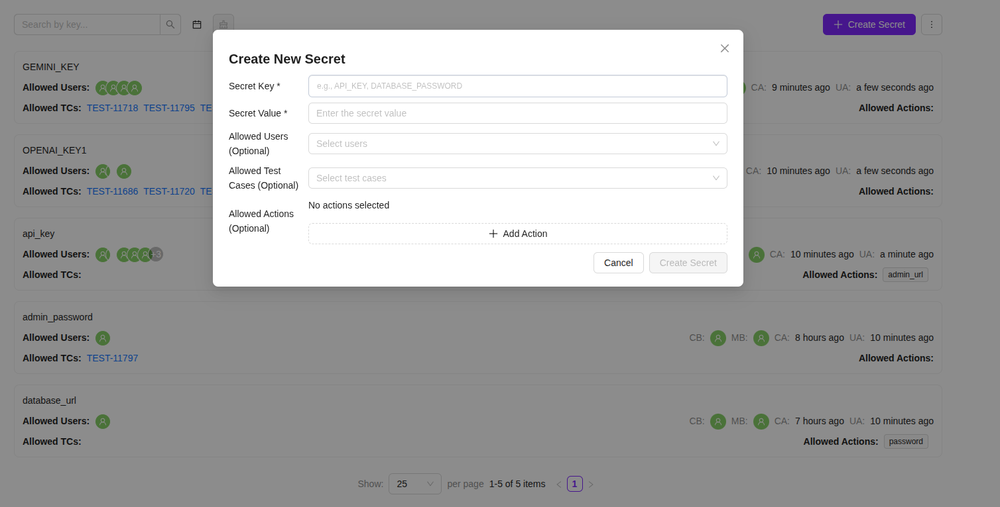
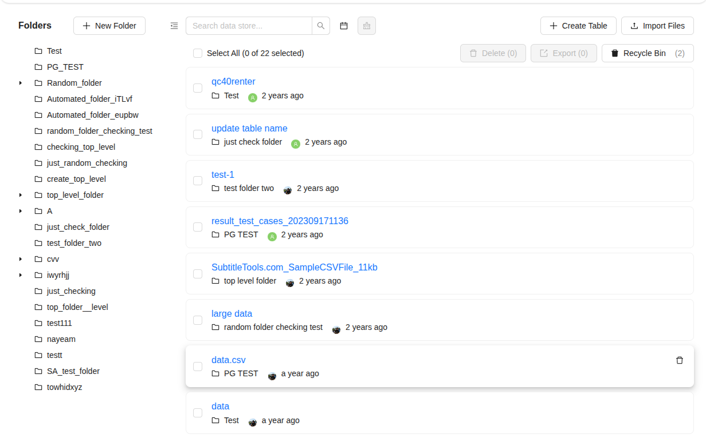

Welcome to the October 2025 release of the ZeuZ platform!

## 🚀 New Features

This release introduces three major new features that significantly enhance security, access control, and data management in ZeuZ:

1. Group Permission System – A powerful, flexible role-based access control mechanism with permission union logic for seamless user and group management.
2. ZeuZ Secrets – A secure, client-side encrypted vault for managing sensitive credentials, ensuring zero exposure of secret data.
3. Revamped Data Store – A completely redesigned ReactJS interface offering faster performance, unified data management, and stronger project-level data isolation.

# 1. Enhanced Group Permissions & History Management

## Overview
We're excited to announce three powerful new features that significantly enhance user access control and visibility management in the Zeuz platform. These features provide granular permission control, improved history page customization, and intelligent test case visibility filtering.

---

## 🎯 Sub-feature 1: Group Permission System



### What's New
Introducing a comprehensive group-based permission system that allows administrators to create custom user groups with specific access rights across the entire platform.

### Key Capabilities
- **Flexible Group Management**: Create and manage user groups with custom permissions
- **Granular Access Control**: Assign specific permissions for different platform modules
- **Role-Based Security**: Control access to testing, project management, and administrative functions
- **Easy User Assignment**: Add users to groups with automatic permission inheritance
- **🔄 Permission Union Logic**: Users get **combined permissions** from ALL their groups - if ANY group has a permission, the user gets access

### Permission Union Example
```
User belongs to: Group 1, Group 2, Group 3

Group 1: ✅ Can view Set page
Group 2: ❌ Cannot view Set page  
Group 3: ❌ Cannot view Set page

Result: ✅ User CAN view Set page (because Group 1 has permission)
```

### Benefits
- **Enhanced Security**: Fine-grained control over who can access what
- **Simplified Management**: Centralized permission management through groups
- **Flexible Access**: Users can have different permissions through different group memberships
- **Scalable Architecture**: Easy to add new permissions and groups as needed
- **Backward Compatibility**: Existing users automatically get full access through default group

---

This permission union logic is particularly powerful because:

1. **Flexible Role Assignment**: Users can be in multiple groups with different purposes
2. **Cumulative Permissions**: No need to duplicate permissions across groups
3. **Easy Management**: Add users to groups without worrying about permission conflicts
4. **Granular Control**: Fine-tune access by adding/removing users from specific groups

For example:
- **Group A**: Test Engineers (can view test cases, run tests)
- **Group B**: Project Managers (can view reports, manage milestones)  
- **Group C**: Administrators (can manage users, system settings)

A user in both Group A and Group B would have permissions from both groups, allowing them to view test cases AND reports, but not administrative functions unless they're also in Group C.

This makes the permission system very flexible and user-friendly while maintaining security!

---

## 🔍 Sub-feature 2: Micro-Level Permission Control on History Page



### What's New
Transform your history page experience with granular visibility controls that let you customize exactly what information users can see on deployment history cards.

### Customizable History Elements
Users can now control visibility of these history page elements:
- **Run ID** → View
- **Node ID** → View  
- **Milestone** → View
- **Objective** → View
- **Version** → View
- **Tester** → View
- **Deployment Time** → View
- **Duration** → View
- **Storage** → View
- **Details** → View
- **Runtime Parameters/Details** → View
- **Test Case** → View
- **Test Case Type** → View
- **Browser** → View
- **Testcase Log** → View
- **Circle Graph** → View
- **Status** → View

### How It Works
- **Group-Based Control**: Permissions are managed at the group level
- **Toggle Interface**: Easy-to-use toggle switches for each element
- **Real-Time Updates**: Changes apply immediately to user views
- **Permission Inheritance**: Users inherit permissions from their assigned groups

### Benefits
- **Cleaner Interface**: Hide irrelevant information to reduce clutter
- **Role-Appropriate Views**: Show only relevant data based on user roles
- **Improved Focus**: Users see only what they need for their specific tasks
- **Enhanced Security**: Sensitive information can be hidden from unauthorized users

---

## 🎯 Sub-feature 3: Deploy Page Testcase Visibility Control



### What's New
Intelligent test case visibility filtering that ensures users only see deployment history for test cases they're authorized to view, with special handling for automated deployments.

### Key Functionality
- **Group-Based Visibility**: Only users in assigned groups can see specific test case deployments
- **Scheduler Deployment Filtering**: Automated scheduler deployments are hidden from general history view
- **Direct Access Preservation**: Users can still access test cases via direct links even if not visible in history
- **Smart Filtering**: System automatically filters history based on user group memberships

### How It Works
1. **During Deployment**: Selected groups are stored with each test run
2. **History Filtering**: Only test runs with matching user groups are displayed
3. **Scheduler Handling**: Automated deployments are filtered out unless user has explicit group access
4. **Access Control**: Direct test case access remains available via links

### Benefits
- **Reduced Noise**: Users don't see irrelevant automated deployments
- **Focused View**: History page shows only relevant test cases
- **Improved Performance**: Faster page loads with filtered data
- **Better Organization**: Clear separation between manual and automated deployments
- **Maintained Access**: Direct links still work for authorized users

---

# 2. A New Level of Security: Introducing ZeuZ Secrets

## Overview
We are happy to announce **ZeuZ Secrets**, a powerful and totally secure system for handling all your sensitive data inside the ZeuZ platform. Now, you can forget about hardcoding API keys, passwords, and tokens in your test cases. With ZeuZ Secrets, you can store, manage, and use all your credentials securely in your test automation, and it's all backed by a powerful hybrid encryption model.

**Your sensitive data will never even leave your browser.** To understand the full details, please read our [docs](https://docs.zeuz.ai/docs/zeuz-server/testing/Data%20Store/zeuz-secrets/).

---

## Feature: Centralised and Secure Secret Management



### What's New
ZeuZ Secrets gives you a special, safe vault inside the platform for all your sensitive data. It is built with a security-first mindset, making sure your secrets are encrypted the moment you create them itself, right until they are used by a trusted test node.

### Key Capabilities
- **Client-Side Encryption**: Secrets are encrypted in your browser first, *before* they are sent to the server. The server will never see the actual, unencrypted value.
- **Hybrid Encryption**: We are using a combination of **RSA-2048** for key security and **AES-256** for data encryption. This ensures full security when data is moving and when it is stored.
- **Node-Side Decryption**: Only a ZeuZ Node that has the correct private key can decrypt and use a secret. No one else can.
- **Granular Access Control**: You can decide exactly which users, which test cases, and even which action patterns are allowed to access each secret.
- **Automatic Log Masking**: Secret values are automatically hidden in all test logs, so nothing gets exposed by mistake.
- **Centralised Management**: You can manage all secrets from one single, secure screen, with proper audit trails.

### The Encryption Workflow
The security of ZeuZ Secrets works with a simple but very powerful end-to-end encryption process:
1.  **Key Generation**: First, an RSA public/private key pair is generated on your ZeuZ Node.
2.  **Configuration**: The **public key** is added to your Team in the ZeuZ admin panel. The **private key** stays safe on the Node itself.
3.  **Secret Creation**: When you are creating a secret in the UI, it is immediately encrypted in your browser using your team's public key.
4.  **Secure Storage**: The encrypted secret is then stored on the ZeuZ server. It cannot be decrypted by the server or any user without the proper private key.
5.  **Secure Usage**: During a test run, the encrypted secret is sent to the Node. The Node uses its private key to decrypt the value at the exact moment it's needed for a test step.

### Benefits
- **No More Hardcoded Secrets**: This will improve your security a lot by removing sensitive data from your test cases and code.
- **Simple Management**: Having one single place for all secrets makes managing and changing them very easy.
- **Secure Collaboration**: You can share secrets with your teams without anyone seeing the actual secret values.
- **Achieve Compliance**: You can track every use of a secret with detailed audit trails, linking access to specific test runs and actions.
- **Smooth CI/CD Integration**: You can securely inject secrets into your automated CI/CD pipelines without any manual work.

---

## Getting Started: Your First Secret in 3 Simple Steps

### Step 1: Generate & Configure Keys
On your ZeuZ Node machine itself, you need to generate a new key pair.

```bash
uv run node_cli.py -gpk
```
Just copy the **public key** that is generated. Go to `Admin → Teams & Projects → Team List`, edit your team, and paste the public key in the given field. The private key is now stored safely on your node.

### Step 2: Create the Secret
Go to `Testing → Data Store → ZeuZ Secrets` and click on **Create Secret**.
- **Secret Key**: `demo_api_key` (This is the name you will use to refer to it).
- **Secret Value**: `sk_live_1234567890abcdef` (This is your actual secret, which will be encrypted immediately).


### Step 3: Use the Secret in a Test Case
In any test step where you can give variable input, just use the special `secret` syntax to call your secret. ZeuZ will automatically handle everything, from fetching to decrypting it on the node during the test run.

| id              | element parameter    | Value                           |
| --------------- | -------------------- | ------------------------------- |
| text            | selenium action    | %\|secret["demo_api_key"]\|%     |

And that's it, simple only! Your test automation workflow is now fully secure.


# 3. The Data Store, Reimagined: Faster, Simpler & More Secure

## Overview
We've rebuilt the Data Store from the ground up with a new **ReactJS** front-end. The result is a faster, more secure experience in a single, unified interface. We've streamlined the entire workflow and, most importantly, locked down data security.



---

### One Page for Everything
No more jumping between pages to view your data and import new files. Now, you can manage tables, create folders, and import CSVs all from a single screen. The new workflow is much more intuitive and makes organizing your test data a breeze.


---

### Major Security & Bug Fixes
- **Critical Security Fix**: We fixed a major security flaw that allowed data to be visible across different teams. Your data is now **strictly isolated** to your project, as it should be.
- **Date Filter Fixed**: The date filter was broken, and now it works reliably.
