Welcome to the November 2025 release of the ZeuZ platform!

## 🚀 New Features

This release introduces seven major new features that significantly enhance user experience, AI capabilities, security, setting up ZeuZ node and platform management in ZeuZ:

1. New Test Case Create Page – A redesigned UI with zAI Mode for AI-powered test case generation and improved Simple Mode for streamlined test creation.
2. Inbox & zAI Chat – A universal chat feature with intelligent zAI page assistant, supporting direct messages, group conversations, and multiple thread management.
3. Redesign of Runtime Parameter Component – A simplified, more intuitive interface with improved copy and paste functionality for better user control.
4. Improved Private Key Sharing for ZeuZ Secret – A streamlined, web-based workflow to generate and share private keys directly from the ZeuZ interface.
5. Redesign of Project Management (Beta Release) – A new, simplified UI for all project item types with unified layout and improved usability.
6. Integrated Installer – A one-click installation system for managing essential development tools and prerequisites directly within the application.
7. Groups – A comprehensive group-based permission system with centralized access control and flexible permission management.

## 🐛 Bug Fixes

1. Fixed bug where selected configurations were not being saved.
2. Node stuck issue is fixed.

## 🛠️ Improvements

1. Improved Private Key Sharing for ZeuZ Secret – A streamlined, web-based workflow to generate and share private keys directly from the ZeuZ interface.
2. datastore table pagination amount increased
3. Ctrl+click in test search and datastore will open in a new tab. 
4. New history page will contain Runtime param info.
5. Test case read write segregation in access control

# 1. New Test Case Create Page

## Overview
The Test Case Create Page has received a major update. The redesigned UI is more polished, user-friendly, and intuitive. You can now switch between two modes: the improved **Simple Mode** and the new **zAI Mode**.  
**zAI Mode** is an AI-powered test-case creation workflow, simply describe the scenario you want to automate, and zAI will generate a complete test case for you. You only need to review and add actions; no additional manual setup is required.

In **Simple Mode**, you can define steps before creating the test case. You can also view the most frequently used global steps, add them instantly, search for specific steps, or create new ones with a single click, all before finalizing the test case.

---

## 🎯 zAI Mode Highlights
- Provide a prompt describing your scenario, and zAI will generate multiple test cases for you to choose from.
- zAI suggests everything required for a complete test case.
- You can attach multiple test cases as references; zAI will analyze them thoroughly.
- You can upload text-based files to give zAI more context about your scenario.
- zAI analyzes only the test cases you select.
- Automatically selects the most appropriate folder and feature from your list.
- Clean, minimalistic, and streamlined UI.

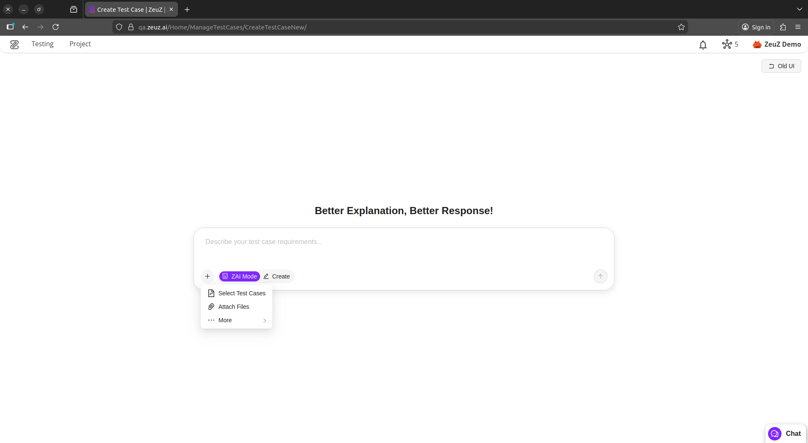

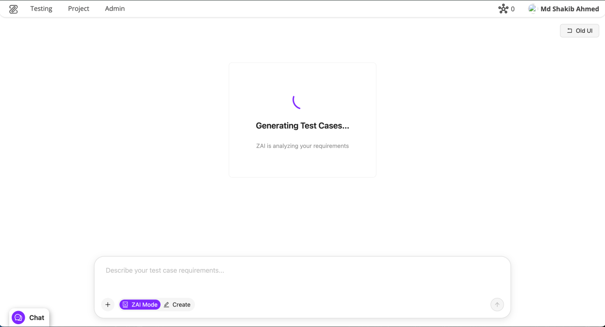

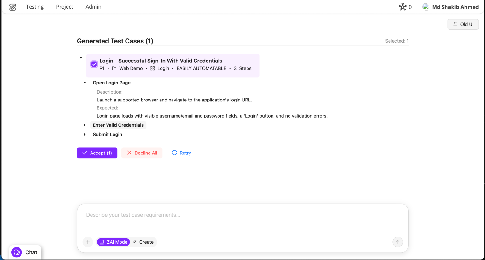

## 🔍 Simple Mode Highlights
- New, clean, and simplified UI design.
- Updated component styling.
- Add steps before creating the test case.
- View the top 10 most-used global steps.
- Search and add any global step.
- Create new steps with just one click.

---

# 2. Inbox & zAI Chat

## Overview
We have introduced a new universal chat feature in ZeuZ. It works similarly to modern chat platforms, offering a clean and simple interface for direct messages or group conversations. The chat supports markdown and user mentions. Our zAI page assistant is now more intelligent & has new look, Chat history & Multiple thread management.

---

## Inbox Highlights
- Start group chats or direct messages between two people.
- Read/unread message tracking.
- Infinite scroll for Chats, Users, and Threads.
- Mention any member in a group.
- Reply to messages.
- Edit your own messages.
- Delete your messages.
- Draggable chat button.
- Unread message count badge.
- Search for specific users, groups, or threads.

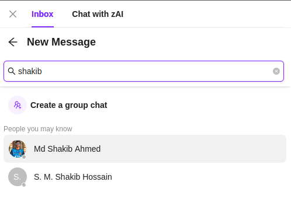

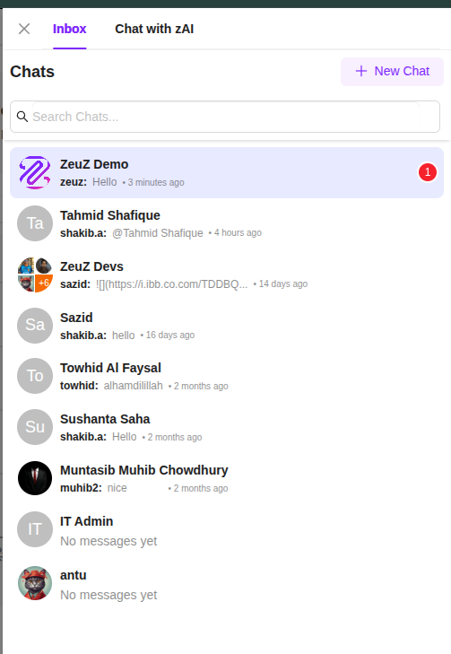

## zAI Page Assist
- Improved accuracy and helpfulness in answering queries.
- Chat history is now saved.
- Support for multiple chats with management features.
- Redesigned and polished UI.
- Delete threads and edit thread titles.
- Smooth, visually enhanced animations.

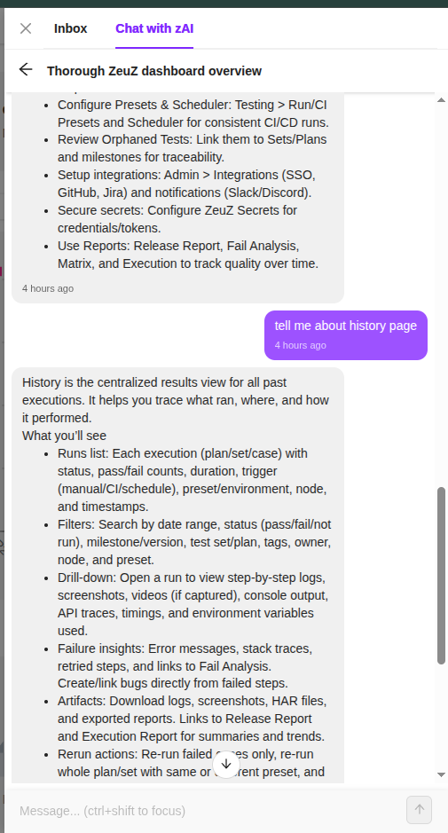

---

# 3. Redesign of Runtime Parameter Component

## Overview
The Runtime Parameter is one of the most used features of ZeuZ. So we took time to make it look simpler, made its usage more straightforward, and removed confusing parts. We also rethought the copy and paste process. Now users have more control over what they are copying and what happens when pasting.

---

### New Design

We added background colors to each Runtime Parameter to make them easily distinguishable. We also rethought the color scheme so users can understand everything at a glance. When no value is selected, it stays grayed out; when a value is selected, it becomes darker to indicate that a selection has been made. There is also a green/gray dot for extra clarity.

By default, the value appears as plain text, making it easy on the eyes. When clicked, it converts into a select component and allows the user to change the value.

The editing and creation UI for Runtime Parameters has also been updated. It now shows a modal for isolation and easier use. We now set the tag automatically to simplify the process. If the user wishes, they can click the tag icon to set a custom value to make it easier to remember.

### Copy & Paste

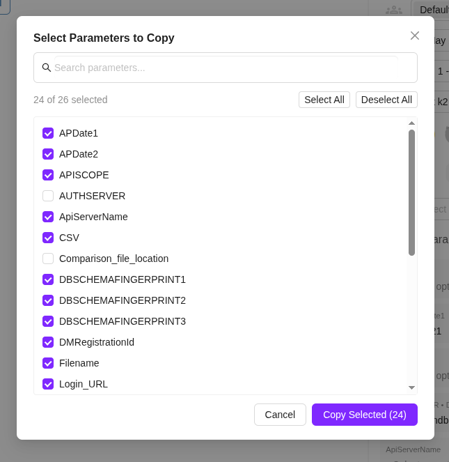

Previously, we only allowed users to copy the entire Runtime Parameter component. Now, we allow users to choose what to copy. This lets users skip unnecessary Runtime Parameter components when copying.

Pasting is also improved. If there is any conflicting value with the same name and tag, a modal will appear allowing the user to rename the tag. They can also replace the existing value by keeping the same tag name.

### Bug Fix
- Fixed a bug where selected configurations were not being saved.

---

# 4. Improved Private Key Sharing for ZeuZ Secret

## Overview
Managing private keys in previous versions of ZeuZ Secret was difficult and time-consuming. Users had to manually access each node to add a secret key, which created a significant challenge—especially for non-technical users. To solve this, we introduced a streamlined, web-based workflow to **generate**, **share** private keys directly from the ZeuZ interface.

---

## Generate Private Key
You can now generate a private key directly from the browser without needing to log in to any node.  
After generating the key, you'll be prompted to select the nodes where the new private key should be stored. ZeuZ will automatically send the key to the selected nodes, removing the hassle of manual setup.

### Share Existing Private Key

If a private key already exists on a specific node, you can share it with other nodes directly from the web interface.

1. Select the node that contains the existing private key.  
2. Choose the nodes where you want that key to be copied.  
3. A secure request will be sent to the source node.  
4. The node encrypts the private key and sends it to the **zsvc**.  
5. The **zsvc** then delivers the encrypted key to the target nodes.

This process ensures the key never leaves the system unencrypted and simplifies multi-node synchronization.

### Allowed Nodes Control
We also introduced an **Allowed Nodes** feature.  
This lets you specify which nodes are permitted to use a particular secret value. It adds an extra layer of security by limiting access only to trusted nodes.

---

# 5. Redesign of Project Management (Beta Release)

## Overview
We are introducing a new, simplified UI for all project item types—**Requirement, Task, Bug, and Document**. This redesign focuses on readability, consistency, and a smoother workflow across all pages.
This update is currently in **Beta** and still **a work in progress**.

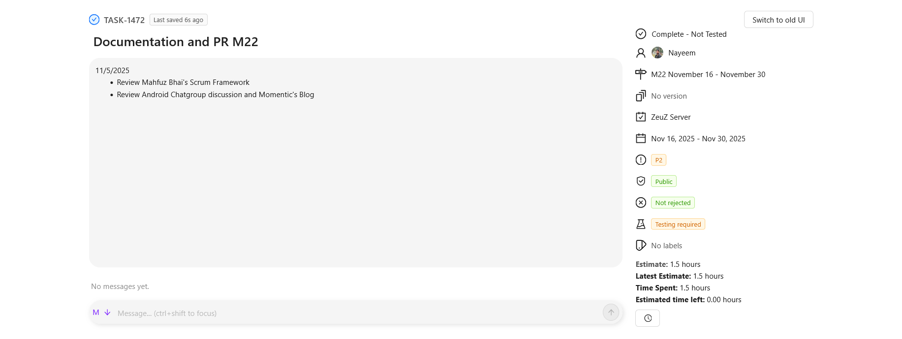

---

## Unified Layout Across All Item Types

All items now share the same clean structure:

### Left Side
- **Description** directly under the title
- **Discussion** section below the description
- Streamlined content area with improved spacing and typography

### Middle and Right Side
- Item metadata neatly grouped, including:
  * Status
  * Owner
  * Milestone
  * Version (if applicable)
  * Feature/Module
  * Priority
  * Visibility (Public/Private)
  * Rejection/Testing indicators
  * Tags/Labels
  * Time estimates (for Task/Bug)
  * Follow
  * Attachment
- All indicators shown as simplified badges for quick scanning

## Cleaner & More Modern Visual Design
- Softer backgrounds
- More whitespace and improved alignment
- Consistent icons and badge styles
- Clearer visual hierarchy for titles, metadata, and discussion threads
- Better long-text readability in descriptions

## Improved Usability
- Faster navigation through simplified page layout
- Reduced clutter from the old UI
- Metadata is easier to find and scan
- Works consistently across Requirement, Task, Bug, and Document pages

## Work-in-Progress Notes
- This is a **Beta version**
- Additional refinements, interactions, and UI polish will follow
- We are collecting feedback to improve the experience further

---

# 6. Introducing the Integrated Installer

## Overview
We are introducing a significant update to our core platform installer, designed to transform your test environment setup from hours of manual configuration into a seamless, single-window experience. This new feature, the Integrated Installer, allows you to **one-click install**, manage, and verify many essential development tools and prerequisites directly within the application, drastically reducing the effort traditionally spent on downloading, setting up environment variables, and running terminal commands.

This update provides integrated installation and status checking for all major test dependencies. For Mobile Automation, you can now install key components like **Android SDK, Java/JDK, ADB, Node.js, and Appium**. This includes a streamlined workflow for installing and launching **Android Emulators** directly. For Database and Web Testing, we have added support for popular database connectors (for **PostgreSQL, MySQL, MariaDB, and Oracle**), as well as dedicated browser support for **Chrome for Testing, Mozilla Firefox, and Microsoft Edge**.

To ensure a smooth setup, we've implemented several quality-of-life enhancements. The installer now automatically checks to make sure you have all the necessary components before starting an installation, guiding you if anything is missing. If an installation fails, you'll see a clear "View Error" button to quickly understand what went wrong. Finally, when the system needs administrator rights (like a sudo password) to install certain services, a secure, built-in window will handle the authorization, making the whole setup process simpler and more secure. All these ensure that you can manage all the pre-requisites and dependencies without ever having to leave the web interface.

### Integrated Installer page

### Checking status of an item

### Installing an item

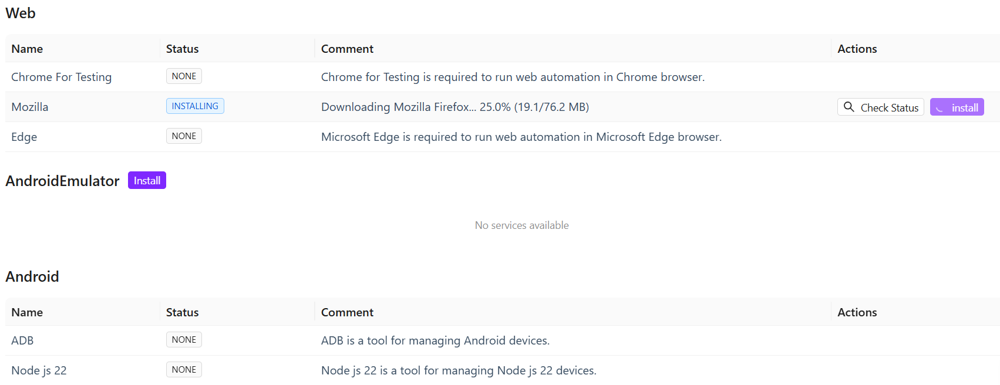

### Machine Password prompt

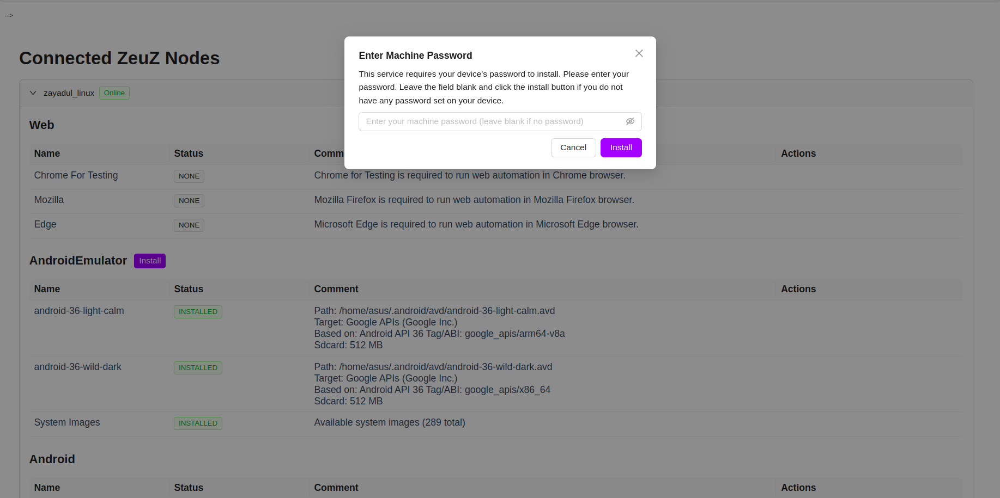

---

# 7. Prevented ZeuZ Node Getting stuck

## Overview

Previously, sometimes a running node becomes undeployable even though the node appears online. This issue has been addressed in this release. Now, nodes that are online will not become undeployable.

# 8. Groups

## Overview
Groups provide a comprehensive group-based permission system that enables centralized access control and flexible permission management across the ZeuZ platform. This feature makes it easy to assign consistent permissions to multiple users, ensuring secure testing operations, controlled execution rights, and organized project access.

---

## Why it matters / Use Cases
- **Centralized access control**: Groups make it easy to assign consistent permissions to multiple users.
- **Secure testing operations**: They restrict who can view, edit, run, or deploy test cases.
- **Controlled execution rights**: Only authorized members can manage executions and runtime parameters.
- **Organized project access**: Groups control access to backlog, tasks, sprints, and documents.
- **Filtered reporting access**: They ensure that only selected users can view specific reports.
- **Protected configuration settings**: Groups prevent unauthorized changes to dashboards, views, or settings.
- **Faster onboarding**: New users automatically receive correct permissions when added to a group.
- **Improved security compliance**: Groups limit access to sensitive actions like admin-level options or deployment controls.

## Prerequisites
- Access to ZeuZ Server with permissions for **Admin → Group Policy → Groups**.
- The user must be able to open the Policy Editor to create or modify groups.
- The user must have sufficient rights to create a new role, edit an existing role, or view available roles.
- Users should already exist in the system so they can be assigned to the group through the Assign Users option.
- Teams must know which actions (view or edit) each role in the group should have before configuring the toggles.

## Quick-Start
1. **Open the Policy Editor**: Navigate to the Policy Editor to view and manage permission policies.
2. **Select a Role**: Choose a role from the list on the left, such as *New group*, *Super Admin Group*, or *Default Group*.
3. **Review Permissions**: View the permissions assigned to the selected role under sections such as Testing, Create/Edit, and Search.
4. **Modify Permissions**: Toggle the *View* or *Edit* options to adjust the permissions for each action.
5. **Save Changes**: Click *Save Changes* to apply the updated permission settings.
6. **Assign Users**: Use the *Assign Users* button to add or remove users from the selected role.

## Permission Resolution Logic

### The Union Rule (Additive OR Logic)
Users can belong to multiple Groups simultaneously. The system uses an **additive (OR logic)** approach to resolve permissions when a user is a member of multiple groups.

#### Core Principle
> **If any single group grants a specific permission to a user, the user has that permission, even if their other groups do not have it.**

#### Global Scope
Permissions are **not project-specific**. If a permission (e.g., "Deploy Test Case") is removed from a Group, that capability is revoked for all Team Projects associated with that Group's context.

#### Example Scenario: "Deploy Test Case"

**User**: John Doe

|  Group Membership  |  Permission Status  |  Can Deploy?  |
|--------------------|---------------------|---------------|
|  Group A           |  OFF                |  ❌ No       |
|  Group B           |  OFF                |  ❌ No       |
|  Group C           |  ON                 |  ✅ Yes      |

**Result**: John Doe **CAN** Deploy Test Cases.

> **Important Note**: A restriction in one group does not override a grant in another. To revoke access entirely, the user must be removed from all groups that grant that specific permission.

### System Admin Group
The **System Admin Group** is the highest-privileged group in the ecosystem, equivalent to "Super Admin" level.

#### Membership
Contains all System Administrators.

#### Capabilities
1. **User Management**: Can add other users to the System Admin Group.
2. **Full System Access**: Has full access to all system features by default.
3. **Exclusive Privilege**: Can view and edit the "Admin Menu Visibility" toggle for other groups.

## Key Features

### Policy Editor Section
- On the left side, the **Policy Editor** panel lists existing roles. One example, "New Group", is visible with *76 permissions* assigned.
- The **Create Role +** button is available on the right side of the Policy Editor.
- A modal window titled **Create New Role** is displayed at the center of the screen.
- The form includes a mandatory field labeled **Role Name**, where the user is expected to type the name of the new role.
- Two action buttons are provided:  
  - **Cancel**: Closes the popup without creating the role.
  - **Create Role**: Confirms the creation of the new role once a valid name is entered.

### Edit / Delete Roles
- The label **Editing** indicates that the user is working on the details or configuration of the selected role.
- The role's name, **New group**, is displayed beside the label for quick identification.
- Two action buttons appear on the right side:  
  - **Edit**: Allows the user to modify the role's name or settings.
  - **Delete**: It is highlighted in red to signal a critical action, as it is used to permanently delete the role.
- A text field is provided containing the updated role name, **New group edit**.
- On the right side, a **Save** button is available, which the user must click to confirm and store the changes. This layout allows users to modify a role's name and save the updated information within the system.

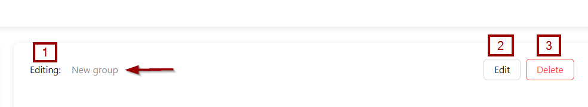

### Assign Users
- The **Assign Users** function is used to link specific users to a particular group or role. In simple terms, it allows an administrator to decide which users should belong to the selected group, so they can receive the permissions, access levels, or restrictions defined for that group.
- After clicking the **Assign Users** button, the following elements become available.:  
  - **Header and Summary**:  
    - **Assign Users to Group**: This is the main title of the page.
    - **4 users assigned**: A summary stating that this specific group currently has 4 members.
    - **None, Developer, Member**: These are likely filters or status indicators for the users, allowing an admin to view users with specific roles (e.g., *Developer*) or no role (*None*).
  - **Add New User Section**: This is the control panel for adding more people to the group.
    - **Select users**: This is a button or a dropdown menu that, when clicked, would open a list of all available users in the system to choose from and add to this group.
  - **Assigned Users Section**: This is a list that displays all the users who are currently members of the group. It has several components:  
    - **Manage users currently assigned to this group**: A sub-heading explaining the purpose of this list.
    - **User List**: A table or list showing the assigned users.
    - **Search Bar**: An admin can use the search box, labeled **Search users by name or role...**, to filter the list and quickly locate a specific user.
    - **Actions**: Each user has a **Remove** button next to their name. Clicking this would remove that specific user from the group.
    - **Pagination Info**:  The text **1-4 of 4 users** and **10 / page** indicates that all 4 users are shown on this first page, and the interface can display up to 10 users per page.
- After clicking the **Save Changes** button, the **Group "New group" updated successfully** message appears.

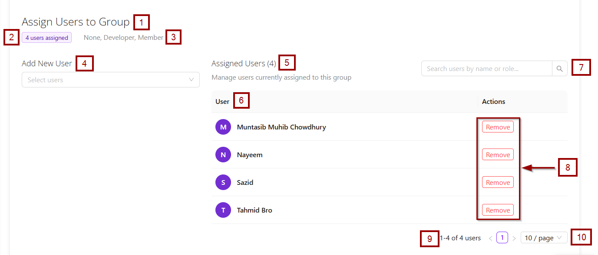

### Show Permissions
- The **Show Permissions** function displays the exact access rights granted to a selected group. It allows administrators to review which actions can be performed.
- After clicking the **Show Permissions** option, all features available under the Testing, Project and Admin for that specific group are displayed. Features that the group can access are indicated by a purple button, while features that are not accessible are shown with a grey button.

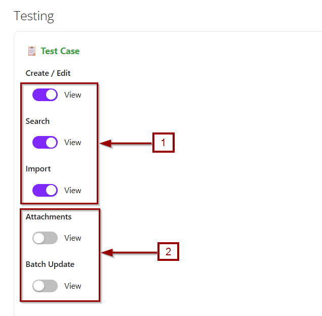

### Grant All / Remove All
- **Grant All**: The **Grant All** function is used to give a group or user full access to all available features or permissions at once. Instead of enabling each permission individually, this option automatically selects all permissions, simplifying the process of assigning comprehensive access.
- **Remove All**: The **Remove All** function is used to revoke all permissions or access rights from a group or user at once. Instead of deselecting each permission individually, this option clears all assigned permissions, effectively removing access to all features.
