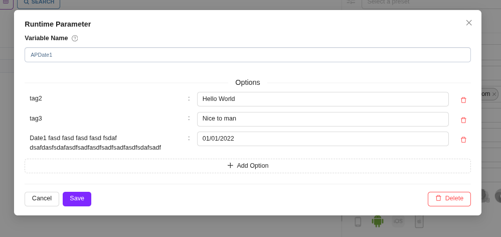
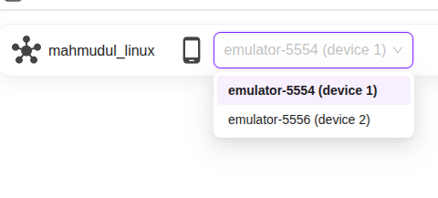
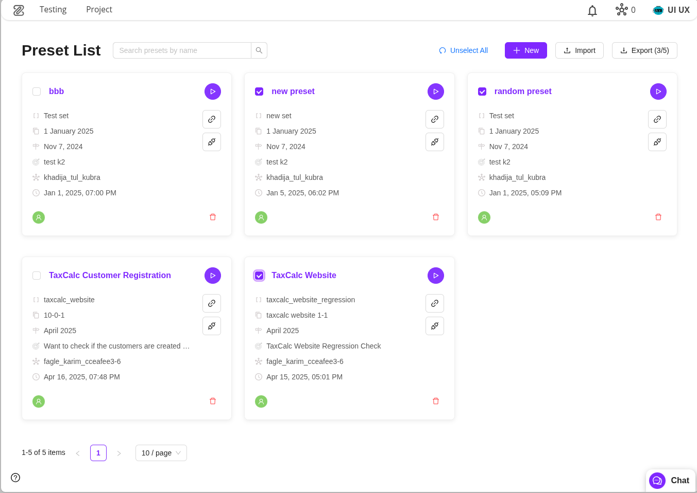
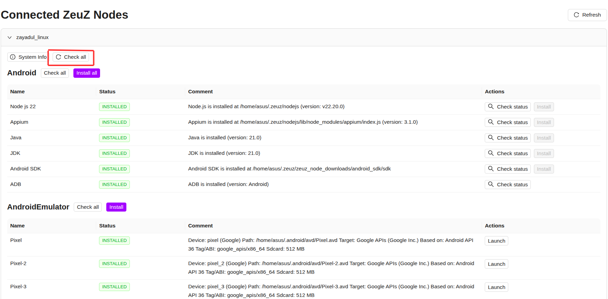
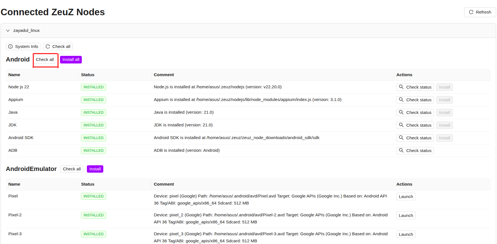
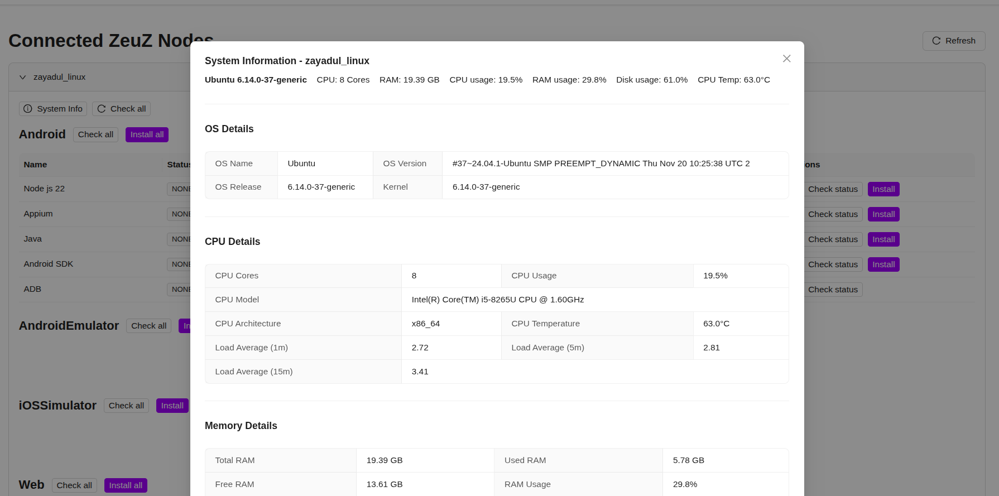
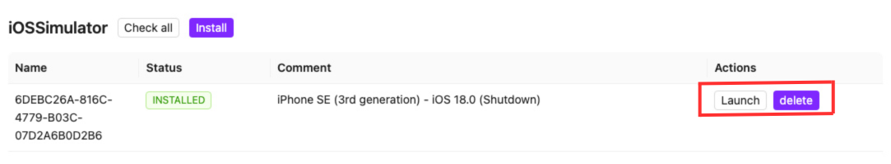
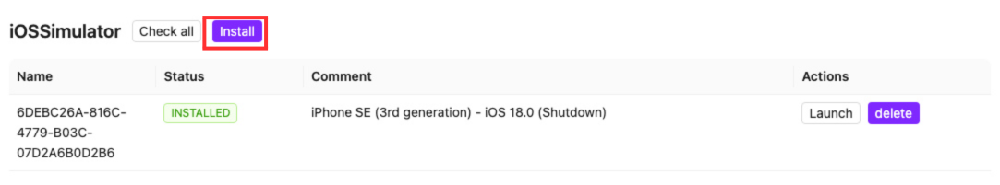
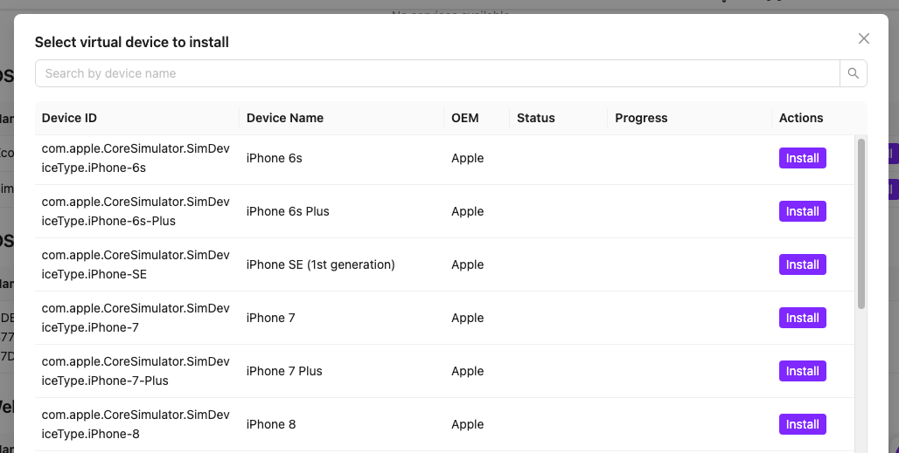

Welcome to the December 2025 release of the ZeuZ platform!

## 🚀 New Features

This release focuses mainly on bug fixes and stability with a few small features.

1. **Improved Runtime Parameter Create/Edit Modal**: Removed tag icon for editable tag name, modal resizing, and consistent styling.
2. **Multi Device Support**: Support for multiple devices in mobile inspector and switching between them.
3. **Fresh New Look for Presets**: Modernized UI, search bar, and improved responsiveness.
4. **Enhancement of Integrated Installer**: Node-level and category-level status checks and installations, system monitoring, and simulator management.
5. **Milestone Page Redesign**: Cleaner experience, dedicated discussion threads, and improved visibility.

<!-- truncate -->

## 1. Improved Runtime Parameter Create/Edit Modal
Our previous implementation had some inconvenience like user had to click the tag icon to edit tag. This is now fixed. You can now click on tag name to edit it. As soon as you click on the tag name an input field will appear.

1. Removed tag icon. Instead it shows editable tag name.
2. Modal size changes based on tag and value length
3. Same background styling added in debug page too

## 2. Multi Device Support

Previously only one device was allowed in mobile inspector. It was not possible to switch between two devices. Now user can use multiple devices to run test and switch between them.

## 3. Fresh New Look for Presets

We’ve given the Presets page (also known as Run/CI Presets) a complete makeover. While you’ll find all the familiar tools you rely on to manage your presets, the entire experience has been rebuilt to be quicker, cleaner, and more intuitive.

### What’s New:

- **Modernized UI**: Enjoy a sleek "Preset List" design that enhances the card-based interface and reduces visual clutter.
- **Search Bar**: Finding the right preset is now instant. We’ve added a dedicated search bar at the top of the page so you can filter through your list by title in real-time.
- **Improved Responsiveness**: The redesigned components offer a snappier feel and better consistency across different screen sizes.

### Screenshot - full page:

### Screenshot - single card expanded:

### 
Everything you used in the previous version is still there, just presented in a much more polished design.

## 4. Enhancement of Integrated Installer

In this release, we added new features in out intergrated installer to give the user more smooth exprience while setting up required tools and dependencies. With this enhancement, user can easily install all the items unders a single category with just one click, check the tools status with just one click and monitor important system information. 

### Node-level status check option

Now users can check the status of all the tools of a node - which tools are installed and not installed by just clicking the "check all" button under the node name.  This feature eliminates the need to check the status of each tool/dependency one by one. 

### Category-level install option

With this feature, users can install all the tools unders a category at once. For example, under the andorid category there is Nodejs, Appium, Java, Android sdk and Adb. User only need to just click the "install all" button beside the "Android" category name, and it will install all the tools under the "Android" cateogory. 

### Category-level status check option

Alongside with the node-level status check option, user can also check the status of the tools unders a category by clickng the "check all" button beside the cateogory name. 

### Monitor system information

With this feature, users can constantly monitor important system information of the machine that a node is currently running. This feature provide the user important system information such as - 

- Ram usage
- Cpu usage
- Total RAM
- Total CPU
-  OS details (e.g. OS name, version)
- CPU details (e.g. CPU cores, CPU architecture)
- Memory details (e.g. total RAM, free RAM)
- Disk details (e.g. free disk space, mount points)

This feature provides the user dynamic information so that users can constantly monitor RAM usage, CPU usage and other important details that changes frequently.

### Install and launch Android Virtual Devices

This feature enables the user to install their preferred android virtual device and launch them directly from the integrated-installer. Under the "AndroidEmulator" category, users can find a list of already installed android virtual device. And by clicking the "install" button beside the "AndroidEmulator" category name, it will show the list of available android virtual devices that the user can install. 

### Install and launch iOSSimulator

Similiar to Android virtual devices, users can install and launch iOSSimulator through this feature. Under the "iOSSimulator"  category a list of installed iOSSimulator will appear. These simulators can be launch by clicking the launch button. Also, users can delete the simulators using the delete button beside it. A list of avaiable simulators users can install will appear by clicking the "install" button beside the "iOSSimualtor" category .

### Walk through

Here is a walk through video of the node-installer feature - 

<video controls loop>
  <source src="/blog/zeuz-platform-202512/video-1.mp4" type="video/mp4" />
</video>

## 5. Milestone Page Redesign & Extended Functionality
The Milestone page has been redesigned for a cleaner, more modern experience, with enhanced visibility and usability:
- Users can now start dedicated discussion threads on specific milestones.
- Each milestone card displays high-level progress information without needing to open details.
- Linked items are displayed in a modal view with appropriate icons and tooltips for better clarity.

## 🐛 Bug Fixes

1. In set page, the last run was determined by the id. Sometimes id doesn't maintain sequence and having wrong data of test run status. Now we are ordering by last_run_date.
2. In Run Test page when no set was selected and user tries to create preset it should focus on search field to acknowledge user. This has been fixed.
3. Data Store was not allowing empty file upload. Also there proper error message were missing. 
4. Presets page used to show milestone IDs (numbers) instead of milestone names, in the new design this is fixed.
5. When actions are restored from a previous step version, the disabled actions were getting enabled - The issue is fixed.
6. **Isolated GQL filtering for test cases by team/project:** Test case titles were previously treated globally, resulting in duplicate-title conflicts. Filtering is now isolated by team/project, so different teams or projects can use the same test case title without issues.
7. **Folder/Feature filter now supports numeric values:** Numeric inputs were not accepted previously. The GQL filter now correctly recognizes and processes numbers.
8.  **New Test Case creation no longer removes duplicate steps:** When creating a test case via the New TC Create page, identical steps were being de-duplicated automatically. GQL now preserves the full list exactly as selected, even if multiple identical steps are added intentionally.
9. **Discussion mention autocomplete behavior corrected:** Pressing Enter while an autosuggestion was highlighted used to send the message instead of completing the mention. Now, pressing Enter correctly autocompletes the suggestion without sending the message.
10. **Removed 3-digit Test Case ID validation on Debug page:** The Debug page previously enforced a three-digit test case ID format. This validation has been removed to support broader ID formats.
11. **External Webhook Notification**: Failed breakdown webhook notifications were not sent in some cases when more than 15 test cases existed. Fixed the issue.

## 🛠️ Improvements
1. **System messages for Discussion participant changes:** Adding or removing participants from a discussion is now logged automatically as a system message. These entries are visible to everyone and cannot be edited or deleted, increasing transparency.
2. **Discussion threads available across more entities:** Users can now initiate discussion threads on any ticket type, run ID, or milestone.
