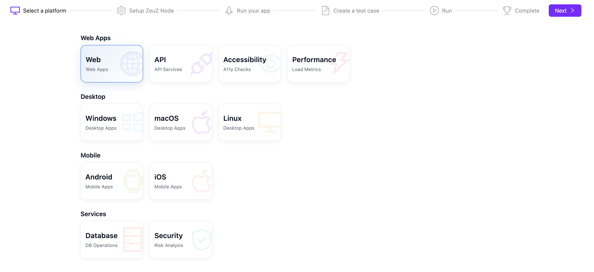
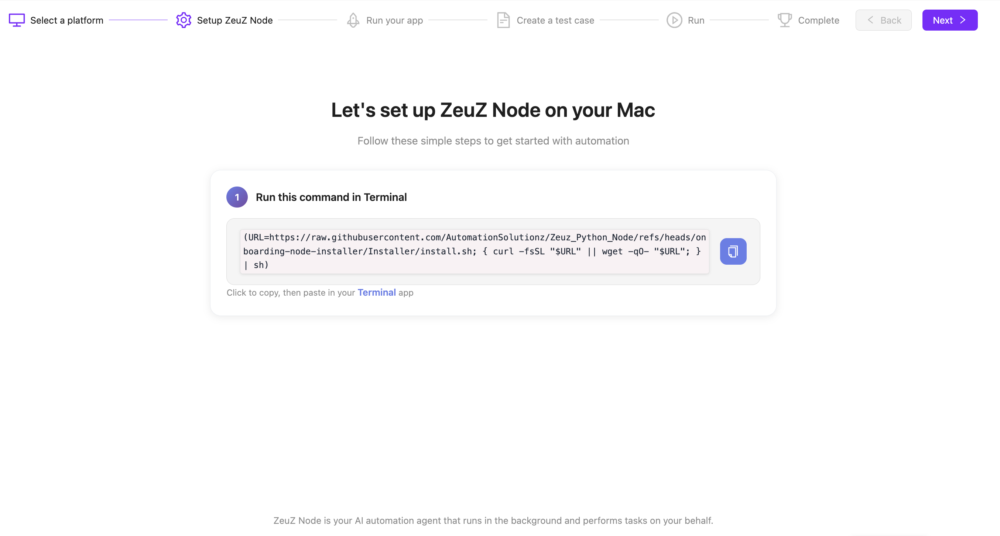
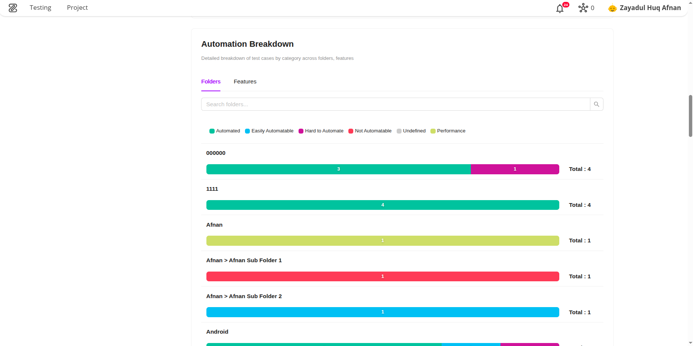
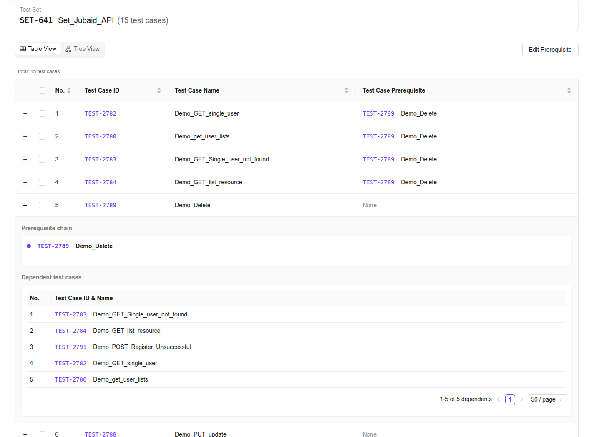
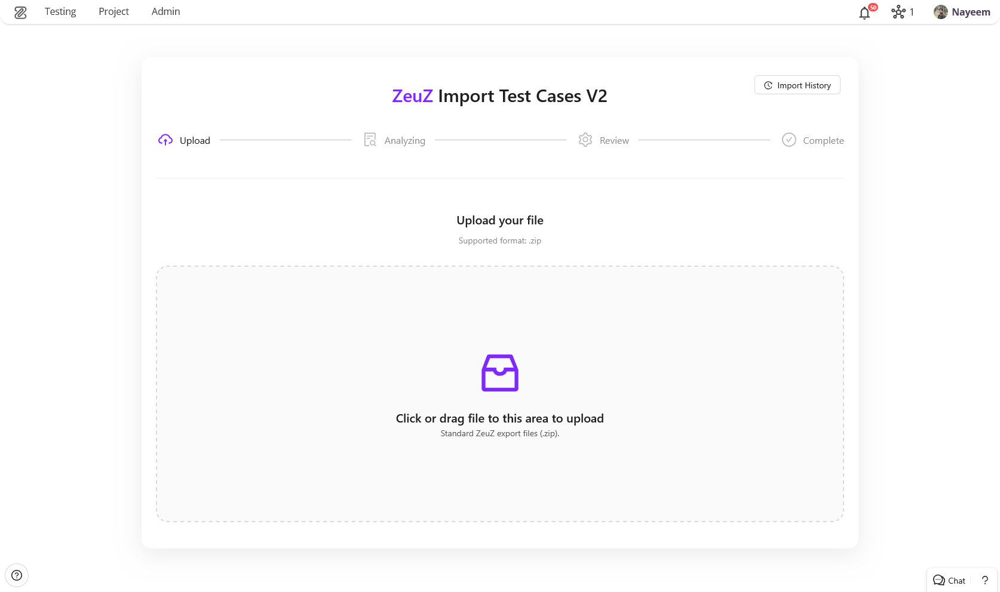
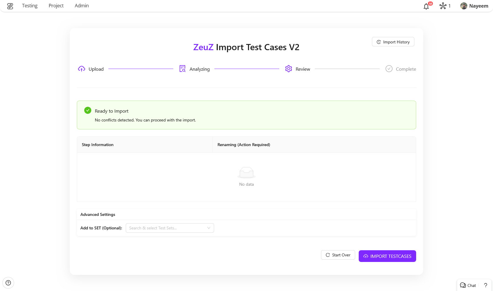
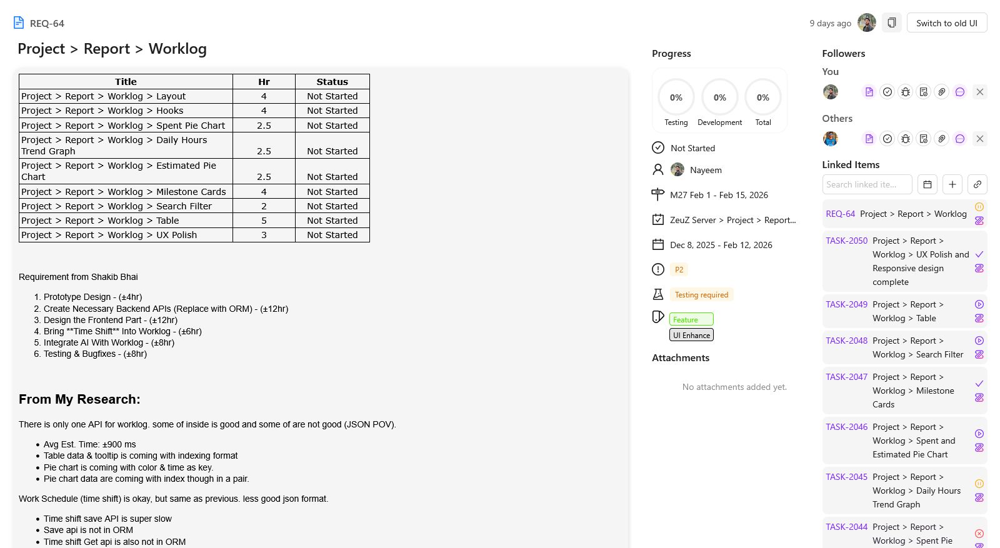
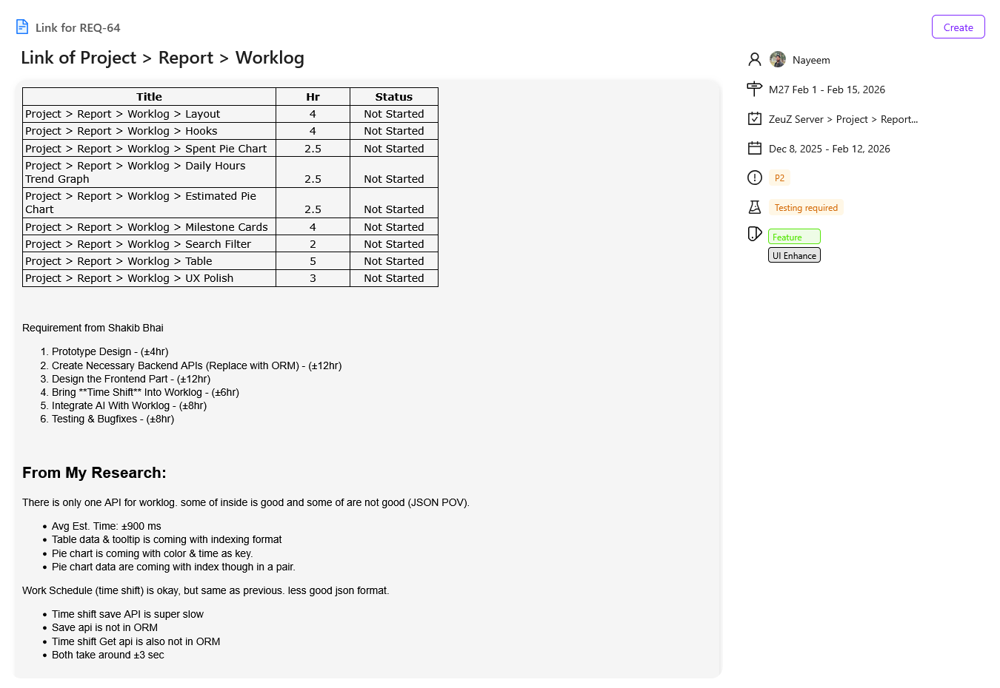

Welcome to the February 2026 release of the ZeuZ platform! This update delivers a major usability upgrade with a brand-new onboarding flow, powerful inspection tools, performance boosts, redesigned analytics and management pages, plus important workflow enhancements and bug fixes.

## 🚀 New Features

1. **New Onboarding Experience:** Guided, platform-aware setup (Web, Android, iOS) with auto node setup, auto test case creation, and first-run execution.
2. **iOS Inspector (New):** AI-powered UI inspection for iOS with automatic environment detection, one-click capture, and smart action suggestions.
3. **Fail Analysis Page Redesign:** Modern UI with multi-card selection, full step visibility, runtime parameters, saved preferences, and quick unassignment.
4. **Logs Slider Enhancements:** Adjustable screenshot size, step status editing, Run ID navigation, and screenshot filtering.
5. **Automatability Report Redesign:** New analytics dashboard with statistics cards, velocity and priority charts, email reports, PDF export, and advanced filtering.
6. **New Prerequisites Management Page:** Visual table and tree views for dependency tracking, intelligent search, and bulk prerequisite editing.
7. **Test Case Import System (New):** Introduced a ZIP-based import system that creates test cases via GraphQL, resolves step conflicts, processes actions in bulk, stores attachments, and tracks progress with metadata.
8. **Project Management Enhancements:** Now fully launched! Previously in beta, this update streamlines ticket creation with auto-populated details for a faster, one-click experience. Includes Version/Milestone creation and a versatile new link component.

## 🐛 Bug Fixes

1. **Action Stability Improvements:** Fixed text entry, scrolling issues, and modernized the tap action using updated Appium APIs.
2. **Data Store UI Fixes:** Enforced 100-file upload limit and improved backend error handling in the UI.
3. **ZeuZ Secret Fix:** “Add your own public key” button is now fully functional.
4. **Scheduler Fix:** Fixed an issue where the scheduler failed to trigger hourly deployments.

## 🛠️ Improvements

1. **Android Inspection Speedup:** UI dump and screenshot generation optimized to complete consistently within **2–3 seconds**.
2. **Integrated Installer Performance:** Node update and install process is now asynchronous for smoother, faster operation.
3. **Run History Load Optimization:** Database-level pagination and filtering dramatically reduce load time.
4. **Test Case Import Reliability & Performance:** Improved import speed and reliability with post-import verification and optimized database connections.

<!-- truncate -->

## 1. New Onboarding Experience
We’re excited to introduce our redesigned onboarding flow, built to ensure every new user gets up and running quickly and correctly. The experience is clean, intuitive, and optimized for all supported platforms.

Currently supported platforms:
- Web
- Android
- iOS

Additional platforms will be added progressively.

#### What’s Included in the New Onboarding Flow
**1. Select Platform**  
Choose the platform you want to automate (Web, Android, or iOS). The onboarding steps will dynamically adapt based on your selection.

**2. Set Up ZeuZ Node**  
Follow a guided, step-by-step process to install and configure ZeuZ Node locally. Clear instructions ensure a smooth setup without manual guesswork.

**3. Run Your App**  
The system automatically installs required platform dependencies while you upload your application or provide the necessary configuration details for automation.

**4. Create Test Case (Auto-Generated)**  
Once your app is uploaded and dependencies are ready:
- A test case is automatically created for you.
- A default **Launch Action** is added.
- You can immediately start building your scenario.
- With **zAI**, adding actions becomes fast and intuitive.

**5. Execute Test Case**  
Run your newly created test case directly from the onboarding flow and validate your setup end-to-end.

**6. Completion**  
You’ll see a confirmation screen once everything runs successfully. From there, you can:
- Start building advanced automation scenarios
- Explore additional platforms

This new onboarding flow removes friction, reduces setup errors, and ensures users reach a successful first execution as quickly as possible.

---

## 2. iOS Inspector (New)
We’re introducing **iOS Inspector**, a new UI element inspection tool fully integrated with ZeuZ (zAI). It streamlines iOS UI analysis and test case creation by automatically connecting to your active environment and providing intelligent action suggestions.

If you are on the iOS Inspector page while your iOS Simulator and ZeuZ Node are running, the system will automatically detect both and initialize the required inspector services. Simply click **Capture** to take the latest screenshot of the simulator screen. From there, you can interact directly with the captured UI.

When you click on any point in the screenshot, zAI analyzes the selected location and generates multiple recommended action combinations that can be added directly to your test case; similar to the Android Inspector workflow, but optimized for iOS.

<video controls loop>
  <source src="/blog/zeuz-platform-202602/video-1.mp4" type="video/mp4" />
</video>

#### Key Features
- **Automatic Environment Detection**  
  Detects active ZeuZ Node and iOS Simulator instances and starts inspector services automatically.
- **One-Click UI Capture**  
  Instantly capture the current simulator screen for inspection.
- **AI-Powered Element Analysis**  
  Clicking on any area of the screenshot triggers zAI analysis to identify UI elements.
- **Smart Action Suggestions**  
  Generates multiple action combinations based on the selected element, enabling faster and more accurate test case creation.

---

## 3. Fail Analysis Page Redesign
Fail analysis page has been redesigned with a modern UI and significantly improved usability. Notable improvements include:

- Updated and consistent icon set
- Select all cards in a group with a single click
- Multi-card selection using:
  - `Ctrl + click` (start card)
  - `Alt + click` (end card)
- All test steps are now visible when expanding a card
- Runtime parameters are shown on expand
- Run history is accessible from expanded card view
- Users can now unassign themselves from items
- User preferences (Fail/GitHub/Jira tab + group preference) are now saved

## 4. Logs Slider Enhancements
Logs slider has received multiple upgrades to cover missing core features. New features include:
- Adjustable screenshot size
- Direct navigation to Run ID page from the slider
- Ability to change step status directly from the slider
- Filter actions that do not have screenshots

## 5. Automatability Report Redesign

Automatability report page has been redesigned with modern UI and new features like statistics card, automation velocity, priority breakdown, email report and export report. The report page has been redesigned to provide a comprehensive analytics dashboard that provides insights into test automation metrics, helping teams track automation progress.

#### 1. Statistical Overview Card
- Displays key automation statistics (Total Test Cases, Automated Tests, Automation Rate, Automation Potential)

#### 2. Category Distribution Chart
- Interactive pie chart showing distribution across 6 categories (e.g. Automated, Easily Automated)
- Custom tooltips with detailed breakdown

#### 3. Automation Velocity Chart
Automation velocity measures the rate at which test cases are converted from manual to automated status, showing trends across 6 automation categories over a fixed timeline (12 month by default). It helps teams identify acceleration or deceleration in automation efforts and assess the effectiveness of automation initiatives.

#### 4. Priority Breakdown Chart
- Stacked bar chart for priorities P1, P2, P3, P4
- Shows total test cases per priority
- Interactive tooltips revealing automatability breakdown within each priority

#### 5. Automation Breakdown
Automation breakdown helps to easily visualize total number of testcases in each folder/feature including including a detailed breakdown by test case category.

#### 6. Email Report Distribution
Users can directly email the automatability report. The email will include:
- The statistics cards  
- Category distribution data  
- Selected filters (e.g., folder, feature, milestone)  
- Report URL for reference

#### 7. PDF Export Functionality
User can export the automatability report as pdf. The report will include everything from the automatability report page. 

#### 8. Filter Data
User can easily filter the automatability report data by folder, feature and milestone. 

---

## 6. New Prerequisites Management Page

We are introducing the **Prerequisites** page, a dedicated workspace to manage execution dependencies within your test sets. You can access this new page from the navigation bar under Testing > Deployments > Prerequisites.

**Who is it for?**
This feature is designed for QA Engineers who manage complex automation workflows where the success of one test depends on the state or outcome of another.

**Why is it useful?**
As test sets grow, tracking "which test runs after which" becomes difficult. This update eliminates the guesswork by providing a centralized, visual map of your test case hierarchy. It prevents execution failures caused by missing dependencies and allows for rapid, bulk updates to your test cases.

#### Key Highlights

* **Dual-Perspective Visualization:**
    * **Table View:** A detailed, searchable list with expandable rows that reveal the full "Prerequisite Chain" (upstream) and "Dependent Test Cases" (downstream).
    * **Tree View:** A folder-like, indented structure that allows you to visualize your entire dependency hierarchy at a glance.

* **Intelligent Search:** Instantly locate specific test sets or individual test cases by Name or ID to see exactly where they sit in the execution flow.
* **Bulk Prerequisite Editing:** Select multiple test cases across either view and use the new **"Edit Prerequisite"** tool to reassign their parent dependency in a single action.
* **Clear Dependency Status:** Quickly identify independent tests vs. those with requirements via the dedicated "Prerequisite" column.

**Prerequisites Home:**

**Table View:**

**Expanded Row in Table View:** 

**Tree View:**

**Bulk Update Prerequisites for Selected Test Cases:** 

**View Prerequisite Chain for a Selected Test Case in the Tree View:**

---

## 7. Test Case Import System (New)

Introduced a ZIP-based import system that creates test cases via GraphQL, resolves step conflicts, processes actions in bulk, stores attachments, and tracks progress with metadata.

#### Workflow

**1. Upload Your File:**

The new landing page allows you to easily upload your ZIP file containing the test case data.

**2. Conflict Resolution:**

The system automatically checks for any step conflicts. If no conflicts are found, it's ready to import.

**3. Background Processing:**

Once the import is started, you'll receive a confirmation. The test cases are then processed in the background.

**4. Import History & Status:**

You can monitor the progress and status of all your imports in the dedicated history view, showing whether they are completed or failed.

---

## 8. Project Management Enhancements

We have significantly enhanced our project management capabilities, moving beyond beta to a fully realized ticket management system. This update focuses on reducing manual entry and providing better integration between internal and external workflows.

#### Key Features

**1. Streamlined Ticket Creation:**

For new users or those creating a ticket in a new project, the system now provides a clean landing page with default selected values. This ensures that you can get started immediately without having to configure every field manually.

**2. Modernized Edit Experience:**

The updated edit page utilizes our latest UI patterns and features the new **Link Component**. This allowed for a more organized overview of ticket details and related entities.

**3. System Message Integration:**

Keep track of title, folder, feature, version, milestone, etc. changes with automatic system messages. Any updates to the status are logged, providing a clear audit trail for the entire team.

**4. Advanced Linking (GitHub & Jira):**

Integration is key! You can now link external GitHub and Jira tickets alongside your internal ZeuZ tickets, centralizing all project-related information in one place.

**5. Intelligent Link Creation:**

When creating a new link, the system intelligently auto-populates relevant data from the edit pages. While these details can be edited before finalizing, the automation significantly reduces the effort required to connect related items.

**6. Hover Information Popover:**

We've added an intelligent popover for linked items. Hovering over a linked ticket ID instantly displays key information, allowing you to quickly cross-reference details without leaving your current view.

**7. Explore More Features:**

While we’ve highlighted the major upgrades, there are many more features and refinements throughout the project management suite waiting to be discovered. We invite you to dive in, experiment with the new tools, and discover how these enhancements can transform your automation workflow.