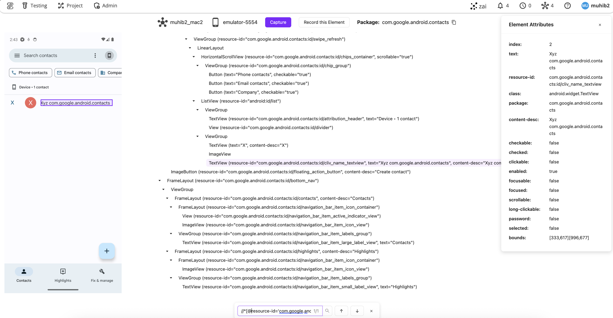

Inspect Android (tm) applications right inside ZeuZ Server without having to
install additional tools such as Appium Inspector or Android uiautomatorviewer.

Installing these tools and configuring them was a real challenge and often times
a nightmare involving hours of fiddling around with setups. Now, all you need to
do is connect your mobile device or launch an emulator in your computer, run
ZeuZ Node and connect it to the ZeuZ server. ZeuZ server will take care of the
rest. This also brought one additional benefit that was otherwise impossible to solve previously:

> You do not have to restart the adb server every time after you've inspected
> them through Appium/uiautomatorviewer.

**Features**

1. **Screenshot and Element Tree Detection**: Improved accuracy in detecting and displaying UI elements.  
2. **Attribute List Panel**: A dedicated right-side panel for inspecting element attributes.  
3. **Search Functionality**: Use **Ctrl+F** to search by CSS, XPath, or value.  
4. **Dual DOM Support**: ADB and Appium now both provide DOM access, eliminating inspection barriers when the Appium server is active.  

